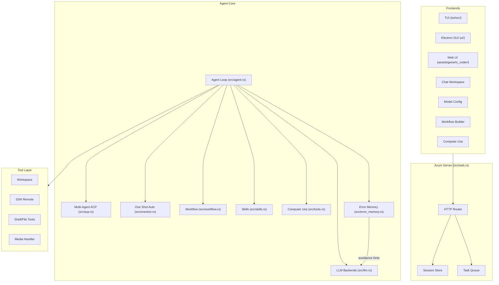
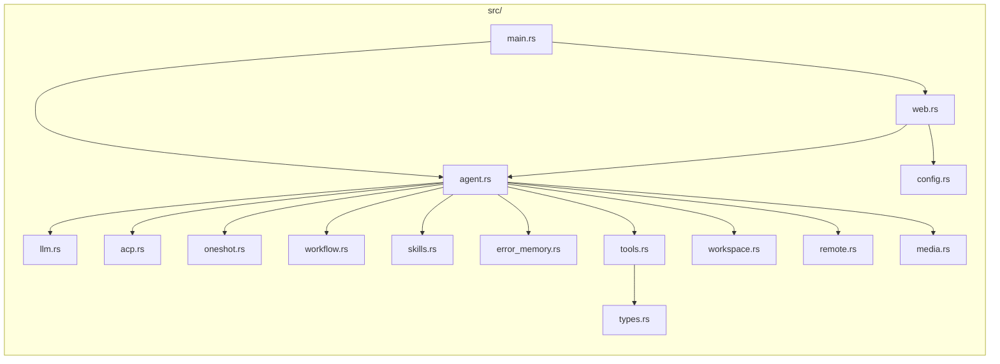

# Generic Coder (Rust)

Rust-first local coding cockpit with an Axum backend, browser Web UI, Electron desktop shell, optional TUI, configurable LLM backends, workspace and Git tools, remote SSH support, workflow modes, ACP multi-agent collaboration, One Shot autonomous mode, and optional Computer Use.

**Language / Idioma / 语言:** [中文](#zh) | [English](#en) | [Español](#es)

---

## Architecture / 架构 / Arquitectura



### Module Map / 模块图



---

<a id="zh"></a>

## 中文

### 这是什么
现已切换为 **Rust 主实现**。当前仓库更适合把它理解为一个“本地运行的编码工作台”，核心由 Axum 服务承载，再接三种前端：

- **浏览器 Web UI**：默认入口，适合快速启动和配置模型
- **Electron 桌面 UI**：独立桌面壳，当前界面样式已经往更轻的 Apple 风格收敛
- **TUI**：终端原生界面，适合键盘流操作

当前这套工作台已经能稳定覆盖这些日常场景：

- 与模型对话并触发编码任务
- 保存和切换多套模型配置
- 打开本地工作区，查看文件树、搜索文件、在会话区预览文本或图片文件
- 查看 Git 变更、Diff 与回退辅助
- 连接远程 SSH 环境执行文件和命令操作
- 在需要时启用 ACP 多智能体、One Shot 自主模式、Computer Use

当前推荐入口：

- **Windows 一键启动：** `start-generic-coder.bat`
- **macOS 一键启动：** `bash start-generic-coder.sh`
- **命令行启动：** `cargo run -- serve --host 127.0.0.1 --port 8765`

服务默认运行在：

```text
http://127.0.0.1:8765
```

### 最近一轮界面与交互调整 (2026-05-05)

- Electron 桌面界面继续收紧顶部 chrome，统一为更接近 Apple 风格的字体和工具栏层次。
- Windows 桌面壳会隐藏原生菜单栏，减少顶部干扰。
- 输入栏支持 `ArrowUp` / `ArrowDown` 恢复上一条草稿，附件状态会一起恢复。
- 左下角模型状态卡现在会按命令 usage 正确聚合并显示 Tokens 统计。
- 点击 workspace 文件时，会在 session 区直接显示文本预览，或展示图片预览。
- 附件按钮已从 emoji 改为 SVG 图标，桌面界面观感更统一。

### 当前实现状态

Rust 版本已接管全部运行路径：

| 文件 | 职责 |
|------|------|
| `src/main.rs` | CLI 与服务启动 |
| `src/web.rs` | Axum Web UI 后端，所有 API 路由 |
| `src/agent.rs` | ReAct Agent 循环、任务队列、停止信号 |
| `src/acp.rs` | ACP 多智能体协作协议（Orchestrator + Specialist） |
| `src/oneshot.rs` | One Shot 自主脑暴驱动执行（外层发散 + 内层执行） |
| `src/llm.rs` | Claude / OpenAI 兼容后端与流式解析 |
| `src/workflow.rs` | Work/Plan/Review 三模式工作流管道 |
| `src/skills.rs` | 可插拔技能注册、安装、启用/禁用管理 |
| `src/error_memory.rs` | 持久化错误记忆与自动回避提示 |
| `src/tools.rs` | 文件读写、Shell、Git、Web、Computer Use 等工具实现 |
| `src/workspace.rs` | 本地工作区管理 |
| `src/remote.rs` | SSH 远程环境连接与管理 |
| `src/media.rs` | 图片/媒体文件处理 |
| `src/types.rs` | 共享类型定义 |
| `src/config.rs` | 配置加载与持久化 |
| `tui/src/` | TUI 终端界面 |
| `ui/` | Electron 主进程、预加载脚本、构建配置 |
| `ui/renderer/` | Electron 桌面界面 |
| `assets/generic_coder/` | 浏览器 Web UI 资源 |

### 已支持的能力

- Rust + Axum Web 服务
- **Web UI**：浏览器中使用的默认工作台
- **Electron 桌面 UI**：桌面壳、Apple 风格字体、较轻的顶部 chrome
- **TUI**：终端原生工作台
- 多模型配置、切换与本地持久化
- 本地工作区选择、文件树浏览、文件搜索、文本/图片预览
- Git 变更查看、Diff 预览、回退辅助
- 远程 SSH 连接与文件/命令操作
- 图片上传到上下文
- Work / Plan / Review 三模式工作流
- ACP 多智能体协作
- One Shot 自主模式
- 可插拔技能系统与错误记忆系统
- Computer Use：截图与鼠标/键盘控制
- macOS / Windows 桌面打包脚本

### 模型配置

可以通过两种方式配置模型：

1. **推荐：** 启动后在 Web UI 的 **Settings** 中直接填写
2. 在项目根目录放置 `mykey.json`（参考 `mykey.json.example`）

UI 已内置常见预设，支持直接填写 API Key 使用，包括：

- DeepSeek
- Qwen / DashScope
- Kimi / Moonshot
- MiniMax
- Doubao / Ark
- Tencent Hunyuan
- Baidu Qianfan
- Zhipu
- OpenAI / Anthropic / OpenRouter

也支持手动填写：Session type、Base URL、Provider、Model name、API Key。

UI 保存的配置默认写入当前用户目录，不会自动写回仓库文件。

### 快速开始

#### 1. 安装 Rust

```powershell
rustc --version
cargo --version
```

如果没有 Rust，请先安装 [Rustup](https://rustup.rs/)。

#### 2. 获取代码

```bash
git clone https://github.com/sapsapshen/Generic-Coder-Rust.git
cd Generic-Coder-Rust
```

#### 3. 启动

**Windows**

双击：

```text
start-generic-coder.bat
```

**macOS / Linux**

```bash
bash start-generic-coder.sh
```

**手动启动**

```bash
cargo run -- serve --host 127.0.0.1 --port 8765
```

#### 4. 打开浏览器

```text
http://127.0.0.1:8765
```

### 开发与验证

```bash
cargo test
cargo check --bin generic-coder
cargo run -p tui
```

### 桌面应用构建

**macOS:**
```bash
bash ui/build-macos.sh          # 产出 .dmg 和 .zip
open ui/dist/Generic\ Coder-*-arm64.dmg
```

**Windows:**
```bat
ui\build-windows.bat            # 产出 NSIS 安装包和 .zip
```

### 目录结构

```text
src/
  main.rs           CLI + 服务启动
  web.rs            Web UI 后端 (Axum)
  agent.rs          Agent 循环与任务执行
  acp.rs            ACP 多智能体协作
  oneshot.rs        One Shot 自主脑暴执行
  llm.rs            模型接入与流式解析
  workflow.rs       工作流管道 (Work/Plan/Review)
  error_memory.rs   错误记忆与回避提示
  skills.rs         技能注册与管理
  tools.rs          工具集合 (含 Computer Use)
  workspace.rs      工作区管理
  remote.rs         SSH 远程环境
  media.rs          媒体处理
  types.rs          共享类型定义
  config.rs         配置加载与保存
tui/                TUI 终端界面 (~2060 行 Rust)
ui/                 Electron GUI 桌面应用 + 构建脚本
assets/
  generic_coder/    Web 前端资源 (HTML/CSS/JS)
skills/
  cli-anything/     自然语言转 Shell 命令
  brainstorming/    One Shot 脑暴技能
  code-review/      代码审查
  create-skill/     创建新技能
  file-search/      文件搜索
  self-audit/       自我审计
  webfetch/         网页抓取
memory/             自主记忆系统 (L1-L4)
```

---

<a id="en"></a>

## English

### What it is

Generic Coder：https://github.com/sapsapshen/Generic-Coder
is now a **Rust-first** local coding cockpit. In practice, the repository is organized around one Axum backend and three frontends:

- **Web UI** for the default browser-based workflow
- **Electron desktop UI** for a packaged local desktop experience
- **TUI** for keyboard-first terminal usage

The current day-to-day scope is practical rather than abstract:

- chat with the coding agent and run coding tasks
- save and switch model configurations locally
- open a workspace, browse the tree, search files, and preview text or image files inside the session area
- inspect Git changes, view diffs, and use revert helpers
- connect to a remote SSH workspace
- optionally enable ACP multi-agent mode, One Shot, and Computer Use when needed

Recommended entry points:

- **Windows one-click launcher:** `start-generic-coder.bat`
- **macOS one-click launcher:** `bash start-generic-coder.sh`
- **Manual startup:** `cargo run -- serve --host 127.0.0.1 --port 8765`

Default local URL:

```text
http://127.0.0.1:8765
```

### Latest visible UI and interaction changes (2026-05-05)

- The Electron desktop UI was tightened further, with Apple-style typography and lighter top chrome.
- The Windows desktop shell now hides the native menu bar to reduce top-level noise.
- `ArrowUp` / `ArrowDown` in the input restores the previous draft, including the attached file state.
- The lower-left status card now shows token usage based on aggregated command usage data.
- Clicking a workspace file now previews full text content or an image directly inside the session area.
- The attachment button was replaced with an SVG icon so the desktop UI feels more consistent.

### Current implementation status

The Rust runtime now owns the full execution path:

| File | Purpose |
|------|---------|
| `src/main.rs` | CLI and server startup |
| `src/web.rs` | Axum web backend, all API routes |
| `src/agent.rs` | ReAct agent loop, task queue, stop signals |
| `src/acp.rs` | ACP multi-agent collaboration protocol |
| `src/oneshot.rs` | One Shot autonomous brainstorming-driven execution |
| `src/llm.rs` | Claude / OpenAI-compatible backends and streaming |
| `src/workflow.rs` | Work/Plan/Review 3-mode workflow pipeline |
| `src/skills.rs` | Pluggable skills registry and management |
| `src/error_memory.rs` | Persistent error memory with avoidance hints |
| `src/tools.rs` | File, shell, Git, web, Computer Use tool implementations |
| `src/workspace.rs` | Local workspace manager |
| `src/remote.rs` | SSH remote environment support |
| `src/media.rs` | Image/media file handling |
| `src/types.rs` | Shared type definitions |
| `src/config.rs` | Config loading and persistence |
| `tui/src/` | TUI terminal interface |
| `ui/` | Electron main process, preload, build scripts |
| `ui/renderer/` | Electron desktop renderer UI |
| `assets/generic_coder/` | Browser Web UI assets |

### Included capabilities

- Rust + Axum backend
- Web UI for browser use
- Electron desktop UI for packaged local use
- TUI for terminal-first workflows
- Multi-model configuration with local persistence
- Workspace selection, file tree browsing, search, and text or image preview
- Git change review, diff preview, and revert helpers
- Remote SSH file and command operations
- Image upload into the chat context
- Work / Plan / Review workflow modes
- ACP multi-agent collaboration
- One Shot autonomous mode
- Pluggable skills and persistent error memory
- Computer Use for screenshot and input actions
- macOS / Windows build automation for the desktop shell

### Model configuration

You can configure models in two ways:

1. **Recommended:** save them in **Settings** from the web UI
2. Add a `mykey.json` file in the project root based on `mykey.json.example`

The UI includes ready-to-use presets for common providers:

- DeepSeek
- Qwen / DashScope
- Kimi / Moonshot
- MiniMax
- Doubao / Ark
- Tencent Hunyuan
- Baidu Qianfan
- Zhipu
- OpenAI / Anthropic / OpenRouter

Manual configuration is also supported for session type, base URL, provider, model name, and API key.

Saved UI configurations are written to the local user profile rather than committed to the repository.

### Quick start

#### 1. Install Rust

```bash
rustc --version
cargo --version
```

If Rust is not installed yet, use [Rustup](https://rustup.rs/).

#### 2. Clone the repository

```bash
git clone https://github.com/sapsapshen/Generic-Coder-Rust.git
cd Generic-Coder-Rust
```

#### 3. Start the app

**Windows** — Double-click:

```text
start-generic-coder.bat
```

**macOS / Linux**

```bash
bash start-generic-coder.sh
```

**Manual**

```bash
cargo run -- serve --host 127.0.0.1 --port 8765
```

#### 4. Open the UI

```text
http://127.0.0.1:8765
```

### Development

```bash
cargo test
cargo check --bin generic-coder
cargo build --release
```

### Project structure

```text
src/
  main.rs           CLI + server startup
  web.rs            Web UI backend (Axum)
  agent.rs          Agent loop and task execution
  acp.rs            ACP multi-agent collaboration
  oneshot.rs        One Shot autonomous brainstorming execution
  llm.rs            Model integration and streaming parser
  workflow.rs       Workflow pipeline (Work/Plan/Review)
  error_memory.rs   Error memory and avoidance hints
  skills.rs         Skills registry and manager
  tools.rs          Tool implementations (incl. Computer Use)
  workspace.rs      Workspace manager
  remote.rs         SSH remote support
  media.rs          Media handling
  types.rs          Shared type definitions
  config.rs         Config loading and persistence
tui/                TUI terminal interface (~2060 lines Rust)
ui/                 Electron GUI desktop app + build scripts
assets/
  generic_coder/    Web frontend assets (HTML/CSS/JS)
skills/
  cli-anything/     Natural language to shell commands
  brainstorming/    One Shot brainstorming skill
  code-review/      Code review
  create-skill/     Create new skills
  file-search/      File search
  self-audit/       Self audit
  webfetch/         Web fetch
memory/             Autonomous memory system (L1-L4)
```

---

<a id="es"></a>

## Español

### Qué es

Generic Coder：https://github.com/sapsapshen/Generic-Coder
ahora funciona con una implementación **principalmente en Rust**. En la práctica, el repositorio se usa como un cockpit local de desarrollo con un backend Axum y tres frontends:

- **Web UI** para el flujo por navegador
- **Electron desktop UI** para uso local como app de escritorio
- **TUI** para trabajo centrado en teclado dentro del terminal

La capacidad real hoy se entiende mejor así:

- conversar con el agente y lanzar tareas de código
- guardar y cambiar configuraciones de modelos localmente
- abrir un workspace, navegar el árbol, buscar archivos y previsualizar texto o imágenes dentro de la sesión
- revisar cambios de Git, ver diffs y usar ayudas de revert
- conectarse a un entorno remoto por SSH
- activar ACP multi-agente, One Shot y Computer Use cuando haga falta

Entradas recomendadas:

- **Inicio con un clic en Windows:** `start-generic-coder.bat`
- **Inicio con un clic en macOS:** `bash start-generic-coder.sh`
- **Inicio manual:** `cargo run -- serve --host 127.0.0.1 --port 8765`

URL local por defecto:

```text
http://127.0.0.1:8765
```

### Cambios visibles recientes de UI e interacción (2026-05-05)

- La UI de Electron se volvió más limpia, con tipografía estilo Apple y menos peso visual arriba.
- En Windows, la app de escritorio oculta la barra de menú nativa para reducir ruido.
- `ArrowUp` / `ArrowDown` en el cuadro de entrada recuperan el borrador anterior, incluido el adjunto.
- La tarjeta inferior izquierda ahora muestra tokens agregados a partir del usage real del comando.
- Al hacer clic sobre un archivo del workspace, la sesión muestra una previsualización de texto completo o de imagen.
- El botón de adjuntar ya no usa emoji; ahora usa un icono SVG más consistente.

### Estado actual de la implementación

La ruta de ejecución completa está controlada por Rust:

| Archivo | Propósito |
|---------|-----------|
| `src/main.rs` | CLI e inicio del servidor |
| `src/web.rs` | Backend web (Axum), todas las rutas API |
| `src/agent.rs` | Bucle del agente ReAct, cola de tareas, señales de parada |
| `src/acp.rs` | Protocolo de colaboración multi-agente ACP |
| `src/oneshot.rs` | Ejecución autónoma con lluvia de ideas |
| `src/llm.rs` | Backends Claude / OpenAI y streaming |
| `src/workflow.rs` | Pipeline de flujo Work/Plan/Review |
| `src/skills.rs` | Registro y gestión de habilidades |
| `src/error_memory.rs` | Memoria de errores con sugerencias |
| `src/tools.rs` | Implementación de herramientas (incl. Computer Use) |
| `src/workspace.rs` | Gestión del espacio de trabajo |
| `src/remote.rs` | Soporte SSH remoto |
| `src/media.rs` | Manejo de medios |
| `src/types.rs` | Definiciones de tipos compartidos |
| `src/config.rs` | Carga y persistencia de configuración |
| `tui/src/` | Interfaz de terminal TUI |
| `ui/` | Proceso principal de Electron, preload y scripts de build |
| `ui/renderer/` | UI renderer de Electron |
| `assets/generic_coder/` | Recursos de la Web UI en navegador |

### Capacidades incluidas

- backend en Rust + Axum
- Web UI para navegador
- Electron desktop UI para uso local empaquetado
- TUI para flujos de terminal
- configuración multi-modelo con persistencia local
- selección de workspace, árbol de archivos, búsqueda y previsualización de texto o imagen
- revisión de cambios Git, vista previa de diff y ayudas de revert
- operaciones remotas por SSH
- subida de imágenes al contexto del chat
- modos de flujo Work / Plan / Review
- colaboración multi-agente ACP
- modo autónomo One Shot
- sistema de skills y memoria persistente de errores
- Computer Use para capturas e input del sistema
- automatización de build para macOS / Windows

### Configuración de modelos

Puedes configurar modelos de dos formas:

1. **Recomendado:** desde **Settings** en la interfaz web
2. Creando `mykey.json` en la raíz del proyecto a partir de `mykey.json.example`

La UI ya incluye preajustes para proveedores comunes: DeepSeek, Qwen / DashScope, Kimi / Moonshot, MiniMax, Doubao / Ark, Tencent Hunyuan, Baidu Qianfan, Zhipu, OpenAI / Anthropic / OpenRouter.

También se puede configurar manualmente: tipo de sesión, base URL, proveedor, nombre del modelo y API key.

Las configuraciones guardadas desde la UI se escriben en el perfil local del usuario, no en el repositorio.

### Inicio rápido

#### 1. Instala Rust

```bash
rustc --version
cargo --version
```

Si aún no tienes Rust, instala [Rustup](https://rustup.rs/).

#### 2. Clona el repositorio

```bash
git clone https://github.com/sapsapshen/Generic-Coder-Rust.git
cd Generic-Coder-Rust
```

#### 3. Inicia la aplicación

**Windows** — Haz doble clic en `start-generic-coder.bat`

**macOS / Linux**

```bash
bash start-generic-coder.sh
```

**Manual**

```bash
cargo run -- serve --host 127.0.0.1 --port 8765
```

#### 4. Abre la interfaz

```text
http://127.0.0.1:8765
```

### Desarrollo

```bash
cargo test
cargo check --bin generic-coder
cargo build --release
```

### Estructura del proyecto

```text
src/
  main.rs           CLI + inicio del servidor
  web.rs            Backend de la interfaz web (Axum)
  agent.rs          Bucle del agente y ejecución de tareas
  acp.rs            Colaboración multi-agente ACP
  oneshot.rs        Ejecución autónoma con lluvia de ideas
  llm.rs            Integración de modelos y parser de streaming
  workflow.rs       Pipeline de flujo (Work/Plan/Review)
  error_memory.rs   Memoria de errores y sugerencias
  skills.rs         Registro y gestión de habilidades
  tools.rs          Implementación de herramientas (incl. Computer Use)
  workspace.rs      Gestión del espacio de trabajo
  remote.rs         Soporte SSH remoto
  media.rs          Manejo de medios
  types.rs          Definiciones de tipos compartidos
  config.rs         Carga y persistencia de configuración
tui/                Interfaz de terminal TUI (~2060 líneas Rust)
ui/                 App de escritorio Electron GUI + scripts
assets/
  generic_coder/    Recursos del frontend web (HTML/CSS/JS)
skills/
  cli-anything/     Lenguaje natural a comandos shell
  brainstorming/    Habilidad de lluvia de ideas
  code-review/      Revisión de código
  create-skill/     Crear nuevas habilidades
  file-search/      Búsqueda de archivos
  self-audit/       Auto auditoría
  webfetch/         Descarga web
memory/             Sistema de memoria autónoma (L1-L4)
```
