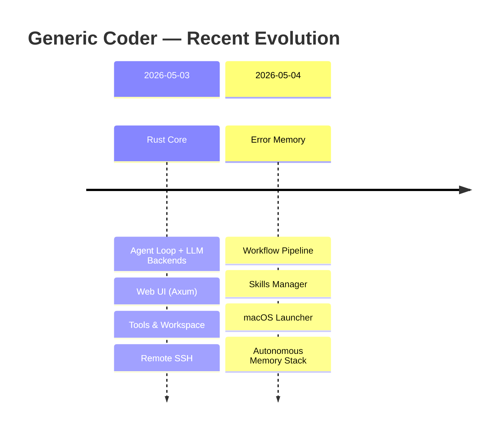
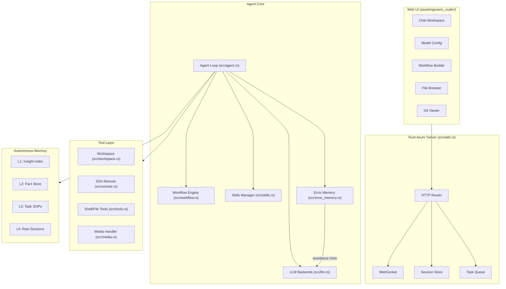
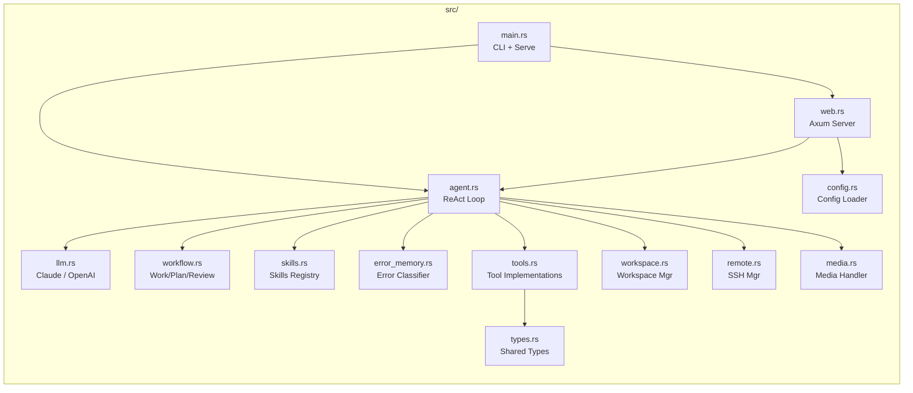

# Generic Coder (Rust)

Rust-native coding cockpit with a built-in web UI, local workspace tools, Git review flows, SSH support, configurable LLM backends, workflow pipelines, and autonomous agent memory.

**Language / Idioma / 语言:** [中文](#zh) | [English](#en) | [Español](#es)

---

## Changelog / 更新日志 / Registro de cambios

### 2026-05-03 → 2026-05-04 — Major Updates / 重大更新 / Grandes actualizaciones



1. **Error Memory System / 错误记忆系统 / Sistema de memoria de errores**
   - Persistent error classification with 5 severity levels (`critical`, `tool`, `system`, `validation`, `unknown`)
   - Automatic fingerprinting (`tool:category`), count tracking, and LLM-aware avoidance hints injected into system prompts
   - On-disk JSON persistence with retention policies

2. **Workflow Pipeline / 工作流管道 / Pipeline de flujo de trabajo**
   - Three agent modes: `WORK` (70 turns), `PLAN` (100 turns), `REVIEW` (50 turns)
   - Drag-and-drop workflow builder supporting up to 3 sequential nodes
   - Mode-specific system prompts, auto-advance, and consecutive-mode validation

3. **Skills Manager / 技能管理器 / Gestor de habilidades**
   - Pluggable `skills/` subsystem with `.meta.json` registry
   - 5 preinstalled skills: `code-review`, `webfetch`, `file-search`, `create-skill`, `self-audit`
   - Install/uninstall, enable/disable, and version tracking support

4. **macOS One-Click Launcher / macOS 一键启动器 / Lanzador de un clic para macOS**
   - `start-generic-coder.sh` with auto-build, health-check polling, and browser auto-open
   - UUID-based picker token for secure local authentication
   - Graceful fallback: `cargo run` → pre-built binary

5. **Autonomous Memory Stack / 自主记忆栈 / Pila de memoria autónoma**
   - L1-L4 layered memory architecture: insight index → fact store → task SOPs → raw sessions
   - Plan mode with subagent delegation, adversarial verification, and failure loops
   - Scheduled task system with scheduler-driven autonomous operation

---

## Architecture / 架构 / Arquitectura



### Module Map / 模块图 / Mapa de módulos



---

<a id="zh"></a>

## 中文

### 这是什么

Generic Coder：https://github.com/sapsapshen/Generic-Coder
现已切换为 **Rust 主实现**。项目通过本地 Web UI 提供一个统一工作台，用于：

- 与模型对话并执行编码任务
- 切换和保存多套模型配置
- 打开本地工作区、查看文件树、搜索文件
- 查看 Git 变更、差异与回退信息
- 连接远程 SSH 工作环境

当前推荐入口：

- **Windows 一键启动：** `start-generic-coder.bat`
- **macOS 一键启动：** `bash start-generic-coder.sh`
- **命令行启动：** `cargo run -- serve --host 127.0.0.1 --port 8765`

服务默认运行在：

```text
http://127.0.0.1:8765
```

### 2026-05-03 → 05-04 重大更新

| 模块 | 描述 |
|------|------|
| **错误记忆系统** | 5级错误分类（critical/tool/system/validation/unknown），自动指纹识别（`tool:category`），计数追踪与回避提示注入 |
| **工作流管道** | 三模式 Agent 管道（WORK 70轮/PLAN 100轮/REVIEW 50轮），拖拽式构建器，模式专属 system prompt |
| **技能管理器** | 可插拔 skills/ 子系统，5个预装技能（code-review/webfetch/file-search/create-skill/self-audit） |
| **macOS 启动器** | 一键启动脚本，自动构建+健康检查轮询+浏览器自动打开，UUID Picker Token 安全认证 |
| **自主记忆栈** | L1-L4 四层记忆架构：索引→事实→SOP→原始会话，Plan 模式含 subagent 委托与对抗性验证 |

### 当前实现状态

Rust 版本已经接管核心运行路径：

- `src/main.rs`：CLI 与服务启动
- `src/web.rs`：Web UI 后端
- `src/agent.rs`：Agent 循环与任务执行
- `src/llm.rs`：Claude / OpenAI 兼容 / 推理与流式解析
- `src/workflow.rs`：Work/Plan/Review 三模式工作流
- `src/error_memory.rs`：持久化错误记忆与回避提示
- `src/skills.rs`：可插拔技能注册与管理
- `src/tools.rs`、`src/workspace.rs`、`src/remote.rs`：工具、工作区、远程环境

旧 Python 代码已不再是默认启动路径。

### 已支持的能力

- Rust + Axum Web 服务
- 聊天工作台与任务轮询
- 多模型配置、切换与本地持久化
- 本地工作区选择：支持图形点选和手动输入路径
- Git 变更查看、差异预览、回退辅助
- 远程 SSH 连接与文件/命令操作
- 图片上传到上下文
- 主题切换与多主题 UI
- Work/Plan/Review 三模式工作流管道
- 持久化错误记忆与自动回避提示
- 可插拔技能系统
- L1-L4 自主记忆架构

### 模型配置

可以通过两种方式配置模型：

1. **推荐：** 启动后在 Web UI 的 **Settings** 中直接填写
2. 在项目根目录放置 `mykey.json`（参考 `mykey.json.example`）

UI 已内置常见预设，支持直接填写 API Key 使用，包括：

- DeepSeek
- Qwen / DashScope
- Kimi / Moonshot
- MiniMax
- Doubao / Ark
- Tencent Hunyuan
- Baidu Qianfan
- Zhipu
- OpenAI / Anthropic / OpenRouter

也支持手动填写：

- Session type
- Base URL
- Provider
- Model name
- API Key

UI 保存的配置默认写入当前用户目录，不会自动写回仓库文件。

### 快速开始

#### 1. 安装 Rust

```powershell
rustc --version
cargo --version
```

如果没有 Rust，请先安装 [Rustup](https://rustup.rs/)。

#### 2. 获取代码

```bash
git clone https://github.com/sapsapshen/Generic-Coder-Rust.git
cd Generic-Coder-Rust
```

#### 3. 启动

**Windows**

双击：

```text
start-generic-coder.bat
```

**macOS / Linux**

```bash
bash start-generic-coder.sh
```

**手动启动**

```bash
cargo run -- serve --host 127.0.0.1 --port 8765
```

#### 4. 打开浏览器

```text
http://127.0.0.1:8765
```

### 开发与验证

```bash
cargo test
```

### 目录结构

```text
src/
  main.rs          CLI + 服务启动
  web.rs           Web UI 后端
  agent.rs         Agent 循环
  llm.rs           模型接入与流式解析
  workflow.rs      工作流管道 (Work/Plan/Review)
  error_memory.rs  错误记忆与回避提示
  skills.rs        技能注册与管理
  tools.rs         工具集合
  workspace.rs     工作区管理
  remote.rs        SSH 远程环境
  media.rs         媒体处理
  types.rs         共享类型定义
  config.rs        配置加载与保存
assets/
  generic_coder/   Web 前端资源
skills/            可插拔技能（5个预装）
memory/            自主记忆系统（L1-L4）
```

---

<a id="en"></a>

## English

### What it is

Generic Coder：https://github.com/sapsapshen/Generic-Coder
is now a **Rust-first** coding cockpit. It provides a local web interface for:

- chatting with an LLM-driven coding agent
- saving and switching model configurations
- opening a local workspace, browsing the tree, and searching files
- reviewing Git changes and diffs
- connecting to a remote SSH environment

Recommended entry points:

- **Windows one-click launcher:** `start-generic-coder.bat`
- **macOS one-click launcher:** `bash start-generic-coder.sh`
- **Manual startup:** `cargo run -- serve --host 127.0.0.1 --port 8765`

Default local URL:

```text
http://127.0.0.1:8765
```

### 2026-05-03 → 05-04 Major Updates

| Module | Description |
|--------|-------------|
| **Error Memory** | 5-tier error classification (critical/tool/system/validation/unknown), auto fingerprinting (`tool:category`), count tracking, avoidance hint injection into system prompts |
| **Workflow Pipeline** | 3-mode agent pipeline (WORK 70t/PLAN 100t/REVIEW 50t), drag-and-drop builder, mode-specific system prompts with auto-advance |
| **Skills Manager** | Pluggable `skills/` subsystem, 5 preinstalled skills (code-review/webfetch/file-search/create-skill/self-audit) with install/uninstall and versioning |
| **macOS Launcher** | One-click startup via `start-generic-coder.sh` — auto build, health-check polling, browser auto-open with UUID picker token auth |
| **Autonomous Memory Stack** | L1-L4 layered memory: insight index → fact store → task SOPs → raw sessions. Plan mode with subagent delegation and adversarial verification |

### Current implementation status

The Rust runtime now owns the supported execution path:

- `src/main.rs` - CLI and server startup
- `src/web.rs` - web backend
- `src/agent.rs` - agent loop and task execution
- `src/llm.rs` - Claude / OpenAI-compatible backends and streaming parsing
- `src/workflow.rs` - Work/Plan/Review 3-mode workflow pipeline
- `src/error_memory.rs` - persistent error memory with avoidance hints
- `src/skills.rs` - pluggable skills registry and manager
- `src/tools.rs`, `src/workspace.rs`, `src/remote.rs` - tools, workspace, and remote environment support

The legacy Python entrypoints are no longer the primary startup path.

### Included capabilities

- Rust + Axum web server
- chat workspace with task polling
- multi-model configuration and local persistence
- local workspace selection with both folder picker and direct path input
- Git change review, diff preview, and revert helpers
- remote SSH connection and file/command operations
- image upload into the chat context
- theme switching and multiple UI themes
- Work/Plan/Review 3-mode workflow pipeline
- persistent error memory with automatic avoidance hints
- pluggable skill system
- L1-L4 autonomous memory architecture

### Model configuration

You can configure models in two ways:

1. **Recommended:** save them in **Settings** from the web UI
2. Add a `mykey.json` file in the project root based on `mykey.json.example`

The UI includes ready-to-use presets for common providers:

- DeepSeek
- Qwen / DashScope
- Kimi / Moonshot
- MiniMax
- Doubao / Ark
- Tencent Hunyuan
- Baidu Qianfan
- Zhipu
- OpenAI / Anthropic / OpenRouter

Manual configuration is also supported for:

- session type
- base URL
- provider
- model name
- API key

Saved UI configurations are written to the local user profile rather than committed to the repository.

### Quick start

#### 1. Install Rust

```bash
rustc --version
cargo --version
```

If Rust is not installed yet, use [Rustup](https://rustup.rs/).

#### 2. Clone the repository

```bash
git clone https://github.com/sapsapshen/Generic-Coder-Rust.git
cd Generic-Coder-Rust
```

#### 3. Start the app

**Windows**

Double-click:

```text
start-generic-coder.bat
```

**macOS / Linux**

```bash
bash start-generic-coder.sh
```

**Manual**

```bash
cargo run -- serve --host 127.0.0.1 --port 8765
```

#### 4. Open the UI

```text
http://127.0.0.1:8765
```

### Development

```bash
cargo test
```

### Project structure

```text
src/
  main.rs          CLI + server startup
  web.rs           Web UI backend
  agent.rs         Agent loop
  llm.rs           Model integration and streaming parser
  workflow.rs      Workflow pipeline (Work/Plan/Review)
  error_memory.rs  Error memory and avoidance hints
  skills.rs        Skills registry and manager
  tools.rs         Tool implementations
  workspace.rs     Workspace manager
  remote.rs        SSH remote support
  media.rs         Media handling
  types.rs         Shared type definitions
  config.rs        Config loading and persistence
assets/
  generic_coder/   Web frontend assets
skills/            Pluggable skills (5 preinstalled)
memory/            Autonomous memory system (L1-L4)
```

---

<a id="es"></a>

## Español

### Qué es

Generic Coder：https://github.com/sapsapshen/Generic-Coder
ahora funciona con una implementación **principalmente en Rust**. Ofrece una interfaz web local para:

- conversar con un agente de programación basado en LLM
- guardar y cambiar configuraciones de modelos
- abrir un espacio de trabajo local, ver el árbol y buscar archivos
- revisar cambios y diffs de Git
- conectarse a un entorno remoto por SSH

Entradas recomendadas:

- **Inicio con un clic en Windows:** `start-generic-coder.bat`
- **Inicio con un clic en macOS:** `bash start-generic-coder.sh`
- **Inicio manual:** `cargo run -- serve --host 127.0.0.1 --port 8765`

URL local por defecto:

```text
http://127.0.0.1:8765
```

### 2026-05-03 → 05-04 Grandes actualizaciones

| Módulo | Descripción |
|--------|-------------|
| **Memoria de errores** | Clasificación en 5 niveles (critical/tool/system/validation/unknown), huella automática (`tool:category`), conteo e inyección de sugerencias de evasión |
| **Pipeline de flujo de trabajo** | Pipeline de 3 modos (WORK 70t/PLAN 100t/REVIEW 50t), constructor visual, prompts específicos por modo |
| **Gestor de habilidades** | Subsistema `skills/` conectable, 5 habilidades preinstaladas (code-review/webfetch/file-search/create-skill/self-audit) |
| **Lanzador macOS** | Arranque con un clic: construcción automática, sondeo de salud y apertura automática del navegador con token UUID |
| **Pila de memoria autónoma** | Memoria en 4 capas L1-L4: índice → hechos → SOPs → sesiones. Modo Plan con delegación a subagente y verificación adversarial |

### Estado actual de la implementación

La ruta de ejecución soportada ya está controlada por Rust:

- `src/main.rs` - CLI e inicio del servidor
- `src/web.rs` - backend de la interfaz web
- `src/agent.rs` - bucle del agente y ejecución de tareas
- `src/llm.rs` - backends compatibles con Claude / OpenAI y parsing de streaming
- `src/workflow.rs` - pipeline de flujo Work/Plan/Review de 3 modos
- `src/error_memory.rs` - memoria persistente de errores con sugerencias de evasión
- `src/skills.rs` - registro y gestión de habilidades conectables
- `src/tools.rs`, `src/workspace.rs`, `src/remote.rs` - herramientas, espacio de trabajo y entorno remoto

Las rutas antiguas en Python ya no son la vía principal de inicio.

### Capacidades incluidas

- servidor web Rust + Axum
- espacio de chat con sondeo de tareas
- configuración múltiple de modelos con persistencia local
- selección de espacio de trabajo local por selector gráfico o ruta manual
- revisión de cambios Git, vista previa de diff y ayuda para revertir
- conexión SSH remota y operaciones de archivos/comandos
- subida de imágenes al contexto del chat
- cambio de tema y varios temas de interfaz
- pipeline de flujo Work/Plan/Review de 3 modos
- memoria persistente de errores con sugerencias automáticas
- sistema de habilidades conectables
- arquitectura de memoria autónoma L1-L4

### Configuración de modelos

Puedes configurar modelos de dos formas:

1. **Recomendado:** desde **Settings** en la interfaz web
2. Creando `mykey.json` en la raíz del proyecto a partir de `mykey.json.example`

La UI ya incluye preajustes para proveedores comunes:

- DeepSeek
- Qwen / DashScope
- Kimi / Moonshot
- MiniMax
- Doubao / Ark
- Tencent Hunyuan
- Baidu Qianfan
- Zhipu
- OpenAI / Anthropic / OpenRouter

También se puede configurar manualmente:

- tipo de sesión
- base URL
- proveedor
- nombre del modelo
- API key

Las configuraciones guardadas desde la UI se escriben en el perfil local del usuario, no en el repositorio.

### Inicio rápido

#### 1. Instala Rust

```bash
rustc --version
cargo --version
```

Si aún no tienes Rust, instala [Rustup](https://rustup.rs/).

#### 2. Clona el repositorio

```bash
git clone https://github.com/sapsapshen/Generic-Coder-Rust.git
cd Generic-Coder-Rust
```

#### 3. Inicia la aplicación

**Windows**

Haz doble clic en:

```text
start-generic-coder.bat
```

**macOS / Linux**

```bash
bash start-generic-coder.sh
```

**Manual**

```bash
cargo run -- serve --host 127.0.0.1 --port 8765
```

#### 4. Abre la interfaz

```text
http://127.0.0.1:8765
```

### Desarrollo

```bash
cargo test
```

### Estructura del proyecto

```text
src/
  main.rs          CLI + inicio del servidor
  web.rs           Backend de la interfaz web
  agent.rs         Bucle del agente
  llm.rs           Integración de modelos y parser de streaming
  workflow.rs      Pipeline de flujo (Work/Plan/Review)
  error_memory.rs  Memoria de errores y sugerencias de evasión
  skills.rs        Registro y gestión de habilidades
  tools.rs         Implementación de herramientas
  workspace.rs     Gestión del espacio de trabajo
  remote.rs        Soporte SSH remoto
  media.rs         Manejo de medios
  types.rs         Definiciones de tipos compartidos
  config.rs        Carga y persistencia de configuración
assets/
  generic_coder/   Recursos del frontend web
skills/            Habilidades conectables (5 preinstaladas)
memory/            Sistema de memoria autónoma (L1-L4)
```
