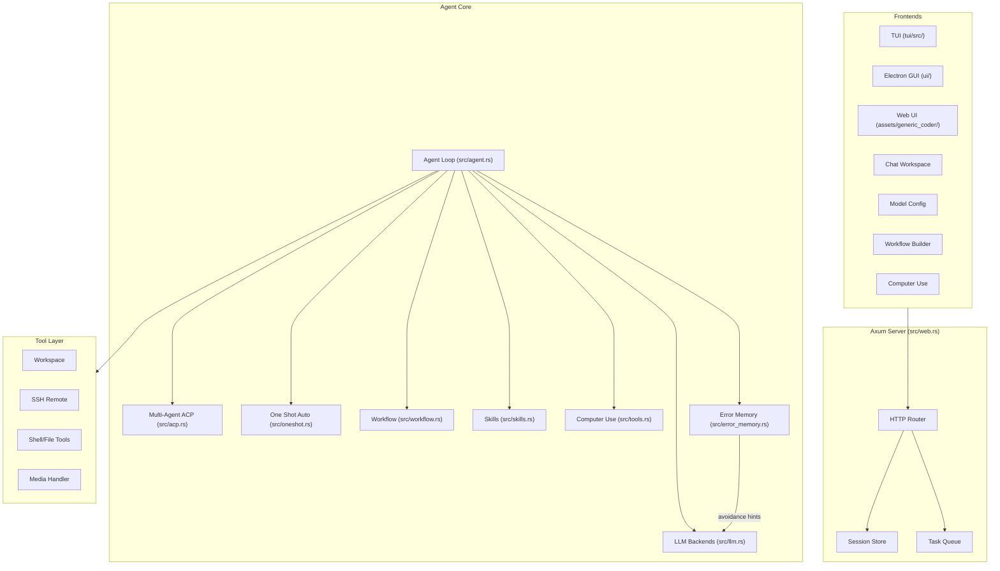
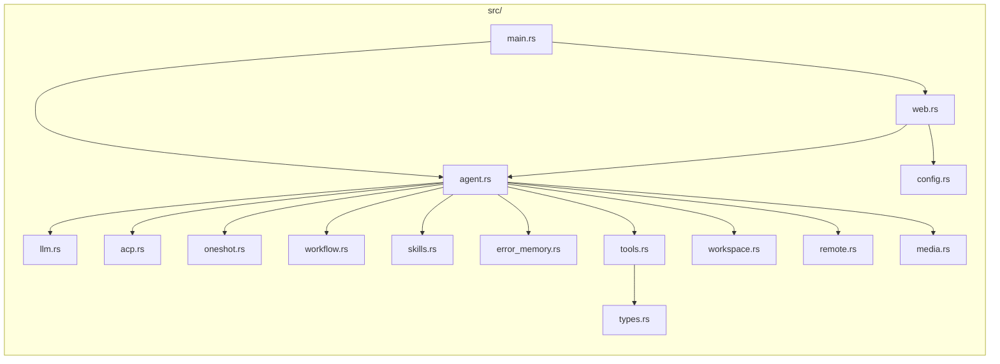

# Generic Coder (Rust)

Rust-native autonomous coding agent cockpit with TUI + Electron GUI + Web UI, Computer Use (screenshot + mouse/keyboard control), local workspace tools, Git review flows, remote SSH support, configurable LLM backends, workflow pipelines, ACP multi-agent collaboration, and One Shot autonomous mode.

**Language / Idioma / 语言:** [中文](#zh) | [English](#en) | [Español](#es)

---

## Architecture / 架构 / Arquitectura



### Module Map / 模块图



---

<a id="zh"></a>

## 中文

### 这是什么

Generic Coder：https://github.com/sapsapshen/Generic-Coder
现已切换为 **Rust 主实现**。项目通过本地 Web UI 提供一个统一工作台，用于：

- 与模型对话并执行编码任务
- 切换和保存多套模型配置
- 打开本地工作区、查看文件树、搜索文件
- 查看 Git 变更、差异与回退信息
- 连接远程 SSH 工作环境
- **三种前端界面**：TUI (终端原生，Vim 键位) + Electron GUI (桌面应用，Apple 字体) + Web UI (浏览器)
- **Computer Use**：AI 直接操控电脑 — 截图 + 12 种鼠标/键盘动作，跨平台 (macOS cliclick + Linux xdotool + Windows PowerShell)
- **多智能体协作 (ACP)**：自动分解任务给 Searcher / Planner / Coder / Reviewer 按序执行
- **One Shot 自主模式**：加载 brainstorming 技能，自动生成分支选项、选择最佳路径、遇到障碍重新发散，直到无新方向才停止

当前推荐入口：

- **Windows 一键启动：** `start-generic-coder.bat`
- **macOS 一键启动：** `bash start-generic-coder.sh`
- **命令行启动：** `cargo run -- serve --host 127.0.0.1 --port 8765`

服务默认运行在：

```text
http://127.0.0.1:8765
```

### 近期重大更新 (2026-05-03 → 05-05)

| 模块 | 描述 |
|------|------|
| **TUI 终端界面** | Rust 原生终端 UI (`tui/`)，10 组件 2060 行，Vim 风格键盘映射 (`hjkl/w/b`)，会话管理、工作流切换、实时流式输出，零编译警告 |
| **Electron GUI 桌面应用** | 独立 Electron 33 桌面应用 (`ui/`)，Apple 原生字体 (SF Pro Text/Display)，16px 默认字号，2.5 倍图标放大，1440×960 窗口，后端自启动 |
| **Computer Use** | AI 直接操控电脑：截图 (`computer_screenshot`) + 12 种鼠标/键盘动作 (`computer_action`)，macOS (cliclick/osascript) / Linux (xdotool/scrot) / Windows (PowerShell) 全平台支持 |
| **cli-anything 技能** | 自然语言转 Shell 命令，支持 macOS/Linux/Windows，自动检测平台并生成适配指令 |
| **构建脚本完善** | macOS `build-macos.sh` 产出 `-arm64.dmg` / `-x64.dmg` / `-arm64-mac.zip` / `-x64-mac.zip` 四种安装包；Windows `build-windows.bat` 含进程清理、前置检查、产物验证 |
| **ACP 多智能体** | Orchestrator 自动分解用户任务为 JSON 执行计划，Searcher → Planner → Coder → Reviewer 角色按序协作，全部 ACP 事件实时流传输到前端渲染 |
| **One Shot 自主模式** | 加载 brainstorming 技能，外循环发散方向、内循环执行推进，遇障碍自动重新发散，seen_options 哈希集去重防循环，三重防耗尽机制 |
| **停止按钮强化** | stop 信号直通 `agent_runner_loop` 每轮检查点，前端立即重置状态并切换新对话，不再等待正在进行的 LLM 请求返回 |
| **拼音输入法修复** | Enter 键发送前检查 `KeyboardEvent.isComposing`，拼音候选词确认回车不再误触发消息发送 |
| **多智能体适用性检测** | 勾选 Multi-Agent 时自动检查当前 prompt 是否适合多智能体（结构词、长度、复杂度等），不适合则弹出提示且无法勾选 |
| **错误记忆系统** | 5级错误分类（critical/tool/system/validation/unknown），自动指纹识别（`tool:category`），计数追踪与回避提示注入 |
| **工作流管道** | WORK/PLAN/REVIEW 三模式，可视化构建器，最多支持 3 个顺序节点，模式专属 system prompt |
| **技能管理器** | 可插拔 `skills/` 子系统，7个预装技能（cli-anything / brainstorming / code-review / webfetch / file-search / create-skill / self-audit） |
| **macOS 工作区选择** | osascript 回退方案，GUI 文件夹选择器在 macOS 上可用 |
| **自主记忆栈** | L1-L4 四层记忆架构：索引→事实→SOP→原始会话，持久化可回顾 |

### 当前实现状态

Rust 版本已接管全部运行路径：

| 文件 | 职责 |
|------|------|
| `src/main.rs` | CLI 与服务启动 |
| `src/web.rs` | Axum Web UI 后端，所有 API 路由 |
| `src/agent.rs` | ReAct Agent 循环、任务队列、停止信号 |
| `src/acp.rs` | ACP 多智能体协作协议（Orchestrator + Specialist） |
| `src/oneshot.rs` | One Shot 自主脑暴驱动执行（外层发散 + 内层执行） |
| `src/llm.rs` | Claude / OpenAI 兼容后端与流式解析 |
| `src/workflow.rs` | Work/Plan/Review 三模式工作流管道 |
| `src/skills.rs` | 可插拔技能注册、安装、启用/禁用管理 |
| `src/error_memory.rs` | 持久化错误记忆与自动回避提示 |
| `src/tools.rs` | 文件读写、Shell、Git、Web、Computer Use 等工具实现 |
| `src/workspace.rs` | 本地工作区管理 |
| `src/remote.rs` | SSH 远程环境连接与管理 |
| `src/media.rs` | 图片/媒体文件处理 |
| `src/types.rs` | 共享类型定义 |
| `src/config.rs` | 配置加载与持久化 |
| `tui/src/` | TUI 终端界面（10 组件，~2060 行 Rust） |
| `ui/` | Electron GUI 桌面应用 + 构建脚本 |

### 已支持的能力

- Rust + Axum Web 服务
- **TUI 终端界面**：Rust 原生，Vim 键位，crossterm/ratatui 渲染
- **Electron GUI 桌面应用**：独立 `.app`/`.exe`，Apple 原生字体，2.5x 图标
- 聊天工作台与任务轮询
- 多模型配置、切换与本地持久化
- 本地工作区选择：支持图形点选和手动输入路径
- Git 变更查看、差异预览、回退辅助
- 远程 SSH 连接与文件/命令操作
- 图片上传到上下文
- 主题切换与多主题 UI（10套配色）
- **Computer Use**：截图 + 12 种鼠标/键盘控制，跨平台
- Work/Plan/Review 三模式工作流管道
- **ACP 多智能体协作**：自动分解→分发→执行→审查
- **One Shot 自主模式**：全自动脑暴驱动开发，无用户干预
- **多智能体适用性检测**：智能判断任务是否适合分解
- 持久化错误记忆与自动回避提示
- 可插拔技能系统（7个预装技能）
- L1-L4 自主记忆架构
- macOS 原生文件夹选择器
- 拼音输入法安全处理
- macOS/Windows 构建脚本自动化

### 模型配置

可以通过两种方式配置模型：

1. **推荐：** 启动后在 Web UI 的 **Settings** 中直接填写
2. 在项目根目录放置 `mykey.json`（参考 `mykey.json.example`）

UI 已内置常见预设，支持直接填写 API Key 使用，包括：

- DeepSeek
- Qwen / DashScope
- Kimi / Moonshot
- MiniMax
- Doubao / Ark
- Tencent Hunyuan
- Baidu Qianfan
- Zhipu
- OpenAI / Anthropic / OpenRouter

也支持手动填写：Session type、Base URL、Provider、Model name、API Key。

UI 保存的配置默认写入当前用户目录，不会自动写回仓库文件。

### 快速开始

#### 1. 安装 Rust

```powershell
rustc --version
cargo --version
```

如果没有 Rust，请先安装 [Rustup](https://rustup.rs/)。

#### 2. 获取代码

```bash
git clone https://github.com/sapsapshen/Generic-Coder-Rust.git
cd Generic-Coder-Rust
```

#### 3. 启动

**Windows**

双击：

```text
start-generic-coder.bat
```

**macOS / Linux**

```bash
bash start-generic-coder.sh
```

**手动启动**

```bash
cargo run -- serve --host 127.0.0.1 --port 8765
```

#### 4. 打开浏览器

```text
http://127.0.0.1:8765
```

### 开发与验证

```bash
cargo test              # 53 测试
cargo build --release   # Release 构建
cargo run -p tui        # TUI 终端界面
```

### 桌面应用构建

**macOS:**
```bash
bash ui/build-macos.sh          # 产出 .dmg 和 .zip
open ui/dist/Generic\ Coder-*-arm64.dmg
```

**Windows:**
```bat
ui\build-windows.bat            # 产出 NSIS 安装包和 .zip
```

### 目录结构

```text
src/
  main.rs           CLI + 服务启动
  web.rs            Web UI 后端 (Axum)
  agent.rs          Agent 循环与任务执行
  acp.rs            ACP 多智能体协作
  oneshot.rs        One Shot 自主脑暴执行
  llm.rs            模型接入与流式解析
  workflow.rs       工作流管道 (Work/Plan/Review)
  error_memory.rs   错误记忆与回避提示
  skills.rs         技能注册与管理
  tools.rs          工具集合 (含 Computer Use)
  workspace.rs      工作区管理
  remote.rs         SSH 远程环境
  media.rs          媒体处理
  types.rs          共享类型定义
  config.rs         配置加载与保存
tui/                TUI 终端界面 (~2060 行 Rust)
ui/                 Electron GUI 桌面应用 + 构建脚本
assets/
  generic_coder/    Web 前端资源 (HTML/CSS/JS)
skills/
  cli-anything/     自然语言转 Shell 命令
  brainstorming/    One Shot 脑暴技能
  code-review/      代码审查
  create-skill/     创建新技能
  file-search/      文件搜索
  self-audit/       自我审计
  webfetch/         网页抓取
memory/             自主记忆系统 (L1-L4)
```

---

<a id="en"></a>

## English

### What it is

Generic Coder：https://github.com/sapsapshen/Generic-Coder
is now a **Rust-first** coding cockpit. It provides a local web interface for:

- chatting with an LLM-driven coding agent
- saving and switching model configurations
- opening a local workspace, browsing the tree, and searching files
- reviewing Git changes and diffs
- connecting to a remote SSH environment
- **Three frontend interfaces**: TUI (terminal-native, Vim keybindings) + Electron GUI (desktop app, Apple fonts) + Web UI (browser)
- **Computer Use**: AI controls your computer — screenshot + 12 mouse/keyboard actions, cross-platform (macOS cliclick + Linux xdotool + Windows PowerShell)
- **Multi-Agent Collaboration (ACP)**: automatic task decomposition into roles (Searcher / Planner / Coder / Reviewer) with sequential execution
- **One Shot Autonomous Mode**: brainstorming-driven self-directed development — generates options, picks the best, executes, re-brainstorms on roadblocks, stops only when exhausted

Recommended entry points:

- **Windows one-click launcher:** `start-generic-coder.bat`
- **macOS one-click launcher:** `bash start-generic-coder.sh`
- **Manual startup:** `cargo run -- serve --host 127.0.0.1 --port 8765`

Default local URL:

```text
http://127.0.0.1:8765
```

### Recent Major Updates (2026-05-03 → 05-05)

| Module | Description |
|--------|-------------|
| **TUI Terminal Interface** | Rust-native terminal UI (`tui/`), 10 components, ~2060 lines, Vim-style keybindings (`hjkl/w/b`), session management, workflow switching, real-time streaming, zero warnings |
| **Electron GUI Desktop App** | Standalone Electron 33 desktop app (`ui/`), Apple native fonts (SF Pro Text/Display), 16px default, 2.5x icon scale, 1440×960 window, backend auto-launch |
| **Computer Use** | AI controls your computer: screenshot (`computer_screenshot`) + 12 mouse/keyboard actions (`computer_action`), macOS (cliclick/osascript) / Linux (xdotool/scrot) / Windows (PowerShell) |
| **cli-anything Skill** | Natural language to shell commands, auto-detects platform and generates adapted commands for macOS/Linux/Windows |
| **Build Scripts** | macOS `build-macos.sh` produces `-arm64.dmg` / `-x64.dmg` / `-arm64-mac.zip` / `-x64-mac.zip`; Windows `build-windows.bat` with process cleanup, prerequisite checks, output verification |
| **ACP Multi-Agent** | Orchestrator auto-decomposes tasks into JSON execution plans; Searcher → Planner → Coder → Reviewer execute sequentially; all events streamed to frontend |
| **One Shot Autonomous** | Loads brainstorming skill, outer loop generates direction options, inner loop executes, automatic re-brainstorming on roadblocks, seen_options dedup and triple exhaustion detection |
| **Stop Button Hardening** | `stop_sig` reaches `agent_runner_loop` per-turn checkpoints; frontend immediately resets state and starts fresh chat |
| **IME Input Fix** | Enter key checks `KeyboardEvent.isComposing` before sending; pinyin candidate confirmation no longer triggers message send |
| **Multi-Agent Suitability** | Automatic heuristic check on toggle — rejects trivial/arithmetic prompts, accepts structural patterns and code tasks |
| **Error Memory** | 5-tier error classification (critical/tool/system/validation/unknown), auto fingerprinting (`tool:category`), count tracking, avoidance hints |
| **Workflow Pipeline** | WORK/PLAN/REVIEW 3-mode pipeline, drag-and-drop builder, up to 3 sequential nodes |
| **Skills Manager** | Pluggable `skills/` subsystem, 7 preinstalled skills (cli-anything / brainstorming / code-review / webfetch / file-search / create-skill / self-audit) |
| **macOS Workspace Picker** | Native folder picker via osascript fallback, works without special environment tokens |
| **Autonomous Memory Stack** | L1-L4 layered memory: insight index → fact store → task SOPs → raw sessions, persistent |

### Current implementation status

The Rust runtime now owns the full execution path:

| File | Purpose |
|------|---------|
| `src/main.rs` | CLI and server startup |
| `src/web.rs` | Axum web backend, all API routes |
| `src/agent.rs` | ReAct agent loop, task queue, stop signals |
| `src/acp.rs` | ACP multi-agent collaboration protocol |
| `src/oneshot.rs` | One Shot autonomous brainstorming-driven execution |
| `src/llm.rs` | Claude / OpenAI-compatible backends and streaming |
| `src/workflow.rs` | Work/Plan/Review 3-mode workflow pipeline |
| `src/skills.rs` | Pluggable skills registry and management |
| `src/error_memory.rs` | Persistent error memory with avoidance hints |
| `src/tools.rs` | File, shell, Git, web, Computer Use tool implementations |
| `src/workspace.rs` | Local workspace manager |
| `src/remote.rs` | SSH remote environment support |
| `src/media.rs` | Image/media file handling |
| `src/types.rs` | Shared type definitions |
| `src/config.rs` | Config loading and persistence |
| `tui/src/` | TUI terminal interface (10 components, ~2060 lines Rust) |
| `ui/` | Electron GUI desktop app + build scripts |

### Included capabilities

- Rust + Axum web server
- **TUI terminal interface**: Rust-native, Vim keybindings, crossterm/ratatui rendering
- **Electron GUI desktop app**: standalone `.app`/`.exe`, Apple native fonts, 2.5x icons
- Chat workspace with task polling
- Multi-model configuration and local persistence
- Local workspace selection with both folder picker and direct path input
- Git change review, diff preview, and revert helpers
- Remote SSH connection and file/command operations
- Image upload into the chat context
- Theme switching with 10 UI themes
- **Computer Use**: screenshot + 12 mouse/keyboard control actions, cross-platform
- Work/Plan/Review 3-mode workflow pipeline
- **ACP multi-agent collaboration** with auto-decomposition
- **One Shot autonomous mode** with brainstorming-driven execution
- **Multi-agent suitability detection** with smart heuristics
- Persistent error memory with automatic avoidance hints
- Pluggable skill system (7 preinstalled skills)
- L1-L4 autonomous memory architecture
- macOS native folder picker
- IME-safe input handling
- macOS/Windows build script automation

### Model configuration

You can configure models in two ways:

1. **Recommended:** save them in **Settings** from the web UI
2. Add a `mykey.json` file in the project root based on `mykey.json.example`

The UI includes ready-to-use presets for common providers:

- DeepSeek
- Qwen / DashScope
- Kimi / Moonshot
- MiniMax
- Doubao / Ark
- Tencent Hunyuan
- Baidu Qianfan
- Zhipu
- OpenAI / Anthropic / OpenRouter

Manual configuration is also supported for session type, base URL, provider, model name, and API key.

Saved UI configurations are written to the local user profile rather than committed to the repository.

### Quick start

#### 1. Install Rust

```bash
rustc --version
cargo --version
```

If Rust is not installed yet, use [Rustup](https://rustup.rs/).

#### 2. Clone the repository

```bash
git clone https://github.com/sapsapshen/Generic-Coder-Rust.git
cd Generic-Coder-Rust
```

#### 3. Start the app

**Windows** — Double-click:

```text
start-generic-coder.bat
```

**macOS / Linux**

```bash
bash start-generic-coder.sh
```

**Manual**

```bash
cargo run -- serve --host 127.0.0.1 --port 8765
```

#### 4. Open the UI

```text
http://127.0.0.1:8765
```

### Development

```bash
cargo test    # 53 tests
cargo build --release
```

### Project structure

```text
src/
  main.rs           CLI + server startup
  web.rs            Web UI backend (Axum)
  agent.rs          Agent loop and task execution
  acp.rs            ACP multi-agent collaboration
  oneshot.rs        One Shot autonomous brainstorming execution
  llm.rs            Model integration and streaming parser
  workflow.rs       Workflow pipeline (Work/Plan/Review)
  error_memory.rs   Error memory and avoidance hints
  skills.rs         Skills registry and manager
  tools.rs          Tool implementations (incl. Computer Use)
  workspace.rs      Workspace manager
  remote.rs         SSH remote support
  media.rs          Media handling
  types.rs          Shared type definitions
  config.rs         Config loading and persistence
tui/                TUI terminal interface (~2060 lines Rust)
ui/                 Electron GUI desktop app + build scripts
assets/
  generic_coder/    Web frontend assets (HTML/CSS/JS)
skills/
  cli-anything/     Natural language to shell commands
  brainstorming/    One Shot brainstorming skill
  code-review/      Code review
  create-skill/     Create new skills
  file-search/      File search
  self-audit/       Self audit
  webfetch/         Web fetch
memory/             Autonomous memory system (L1-L4)
```

---

<a id="es"></a>

## Español

### Qué es

Generic Coder：https://github.com/sapsapshen/Generic-Coder
ahora funciona con una implementación **principalmente en Rust**. Ofrece una interfaz web local para:

- conversar con un agente de programación basado en LLM
- guardar y cambiar configuraciones de modelos
- abrir un espacio de trabajo local, ver el árbol y buscar archivos
- revisar cambios y diffs de Git
- conectarse a un entorno remoto por SSH
- **Tres interfaces**: TUI (terminal nativa, atajos Vim) + GUI Electron (app de escritorio, fuentes Apple) + Web UI (navegador)
- **Computer Use**: la IA controla tu computadora — captura de pantalla + 12 acciones de ratón/teclado, multiplataforma (macOS cliclick + Linux xdotool + Windows PowerShell)
- **Colaboración Multi-Agente (ACP)**: descomposición automática de tareas en roles (Searcher / Planner / Coder / Reviewer) con ejecución secuencial
- **Modo Autónomo One Shot**: desarrollo autodirigido con lluvia de ideas — genera opciones, elige la mejor, ejecuta, repite ante obstáculos, se detiene solo cuando se agotan las ideas

Entradas recomendadas:

- **Inicio con un clic en Windows:** `start-generic-coder.bat`
- **Inicio con un clic en macOS:** `bash start-generic-coder.sh`
- **Inicio manual:** `cargo run -- serve --host 127.0.0.1 --port 8765`

URL local por defecto:

```text
http://127.0.0.1:8765
```

### Actualizaciones recientes (2026-05-03 → 05-05)

| Módulo | Descripción |
|--------|-------------|
| **TUI Interfaz Terminal** | UI de terminal nativa en Rust (`tui/`), 10 componentes, ~2060 líneas, atajos estilo Vim, gestión de sesiones, streaming en tiempo real, cero advertencias |
| **GUI Electron App** | App de escritorio Electron 33 (`ui/`), fuentes Apple nativas, 16px por defecto, iconos 2.5x, ventana 1440×960, backend auto-iniciado |
| **Computer Use** | IA controla tu computadora: captura de pantalla + 12 acciones ratón/teclado, macOS/Linux/Windows |
| **Habilidad cli-anything** | Lenguaje natural a comandos shell, detección automática de plataforma |
| **Scripts de compilación** | macOS `build-macos.sh` produce `.dmg` y `.zip` por arquitectura; Windows `build-windows.bat` con limpieza de procesos, verificación de salida |
| **ACP Multi-Agente** | Orchestrator descompone tareas en planes JSON; Searcher → Planner → Coder → Reviewer ejecutan secuencialmente; todos los eventos transmitidos al frontend |
| **One Shot Autónomo** | Carga habilidad de lluvia de ideas, bucle externo genera direcciones, bucle interno ejecuta, re-lluvia automática ante obstáculos, deduplicación y triple detección de agotamiento |
| **Botón de parada reforzado** | Señal de parada llega a cada iteración de `agent_runner_loop`; frontend reinicia estado inmediatamente y abre nuevo chat |
| **Corrección de IME** | Tecla Enter verifica `KeyboardEvent.isComposing` antes de enviar; confirmación de candidatos pinyin ya no dispara envío |
| **Memoria de errores** | Clasificación en 5 niveles, huella automática, conteo e inyección de sugerencias de evasión |
| **Pipeline de flujo de trabajo** | Pipeline de 3 modos (WORK/PLAN/REVIEW), constructor visual, hasta 3 nodos secuenciales |
| **Gestor de habilidades** | Subsistema `skills/` conectable, 7 habilidades preinstaladas (cli-anything / brainstorming / code-review / webfetch / file-search / create-skill / self-audit) |
| **Selector de workspace macOS** | Selector de carpetas nativo vía osascript |
| **Pila de memoria autónoma** | Memoria en 4 capas L1-L4, persistente |

### Estado actual de la implementación

La ruta de ejecución completa está controlada por Rust:

| Archivo | Propósito |
|---------|-----------|
| `src/main.rs` | CLI e inicio del servidor |
| `src/web.rs` | Backend web (Axum), todas las rutas API |
| `src/agent.rs` | Bucle del agente ReAct, cola de tareas, señales de parada |
| `src/acp.rs` | Protocolo de colaboración multi-agente ACP |
| `src/oneshot.rs` | Ejecución autónoma con lluvia de ideas |
| `src/llm.rs` | Backends Claude / OpenAI y streaming |
| `src/workflow.rs` | Pipeline de flujo Work/Plan/Review |
| `src/skills.rs` | Registro y gestión de habilidades |
| `src/error_memory.rs` | Memoria de errores con sugerencias |
| `src/tools.rs` | Implementación de herramientas (incl. Computer Use) |
| `src/workspace.rs` | Gestión del espacio de trabajo |
| `src/remote.rs` | Soporte SSH remoto |
| `src/media.rs` | Manejo de medios |
| `src/types.rs` | Definiciones de tipos compartidos |
| `src/config.rs` | Carga y persistencia de configuración |
| `tui/src/` | Interfaz de terminal TUI (10 componentes, ~2060 líneas Rust) |
| `ui/` | App de escritorio Electron GUI + scripts de compilación |

### Capacidades incluidas

- servidor web Rust + Axum
- **Interfaz TUI**: nativa Rust, atajos Vim, renderizado crossterm/ratatui
- **App de escritorio Electron GUI**: `.app`/`.exe` independiente, fuentes Apple, iconos 2.5x
- espacio de chat con sondeo de tareas
- configuración múltiple de modelos con persistencia local
- selección de espacio de trabajo local por selector gráfico o ruta manual
- revisión de cambios Git, vista previa de diff y ayuda para revertir
- conexión SSH remota y operaciones de archivos/comandos
- subida de imágenes al contexto del chat
- cambio de tema y 10 temas de interfaz
- **Computer Use**: captura de pantalla + 12 acciones ratón/teclado, multiplataforma
- pipeline de flujo Work/Plan/Review de 3 modos
- **colaboración multi-agente ACP** con descomposición automática
- **modo autónomo One Shot** con ejecución dirigida por lluvia de ideas
- **detección de idoneidad multi-agente** con heurísticas inteligentes
- memoria persistente de errores con sugerencias automáticas
- sistema de habilidades conectables (7 preinstaladas)
- arquitectura de memoria autónoma L1-L4
- selector de carpetas nativo macOS
- entrada segura para IME
- scripts de compilación macOS/Windows

### Configuración de modelos

Puedes configurar modelos de dos formas:

1. **Recomendado:** desde **Settings** en la interfaz web
2. Creando `mykey.json` en la raíz del proyecto a partir de `mykey.json.example`

La UI ya incluye preajustes para proveedores comunes: DeepSeek, Qwen / DashScope, Kimi / Moonshot, MiniMax, Doubao / Ark, Tencent Hunyuan, Baidu Qianfan, Zhipu, OpenAI / Anthropic / OpenRouter.

También se puede configurar manualmente: tipo de sesión, base URL, proveedor, nombre del modelo y API key.

Las configuraciones guardadas desde la UI se escriben en el perfil local del usuario, no en el repositorio.

### Inicio rápido

#### 1. Instala Rust

```bash
rustc --version
cargo --version
```

Si aún no tienes Rust, instala [Rustup](https://rustup.rs/).

#### 2. Clona el repositorio

```bash
git clone https://github.com/sapsapshen/Generic-Coder-Rust.git
cd Generic-Coder-Rust
```

#### 3. Inicia la aplicación

**Windows** — Haz doble clic en `start-generic-coder.bat`

**macOS / Linux**

```bash
bash start-generic-coder.sh
```

**Manual**

```bash
cargo run -- serve --host 127.0.0.1 --port 8765
```

#### 4. Abre la interfaz

```text
http://127.0.0.1:8765
```

### Desarrollo

```bash
cargo test    # 53 tests
cargo build --release
```

### Estructura del proyecto

```text
src/
  main.rs           CLI + inicio del servidor
  web.rs            Backend de la interfaz web (Axum)
  agent.rs          Bucle del agente y ejecución de tareas
  acp.rs            Colaboración multi-agente ACP
  oneshot.rs        Ejecución autónoma con lluvia de ideas
  llm.rs            Integración de modelos y parser de streaming
  workflow.rs       Pipeline de flujo (Work/Plan/Review)
  error_memory.rs   Memoria de errores y sugerencias
  skills.rs         Registro y gestión de habilidades
  tools.rs          Implementación de herramientas (incl. Computer Use)
  workspace.rs      Gestión del espacio de trabajo
  remote.rs         Soporte SSH remoto
  media.rs          Manejo de medios
  types.rs          Definiciones de tipos compartidos
  config.rs         Carga y persistencia de configuración
tui/                Interfaz de terminal TUI (~2060 líneas Rust)
ui/                 App de escritorio Electron GUI + scripts
assets/
  generic_coder/    Recursos del frontend web (HTML/CSS/JS)
skills/
  cli-anything/     Lenguaje natural a comandos shell
  brainstorming/    Habilidad de lluvia de ideas
  code-review/      Revisión de código
  create-skill/     Crear nuevas habilidades
  file-search/      Búsqueda de archivos
  self-audit/       Auto auditoría
  webfetch/         Descarga web
memory/             Sistema de memoria autónoma (L1-L4)
```
