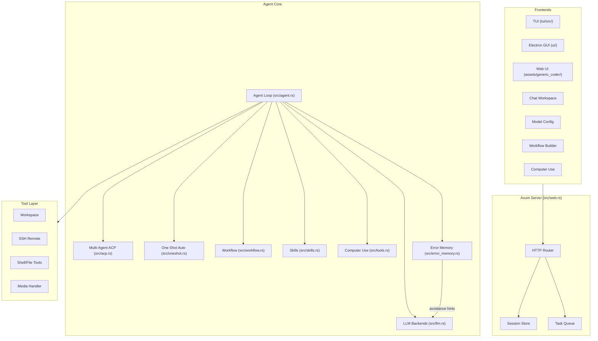
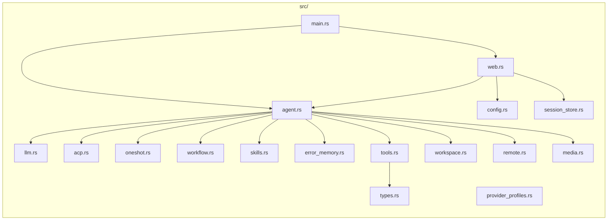
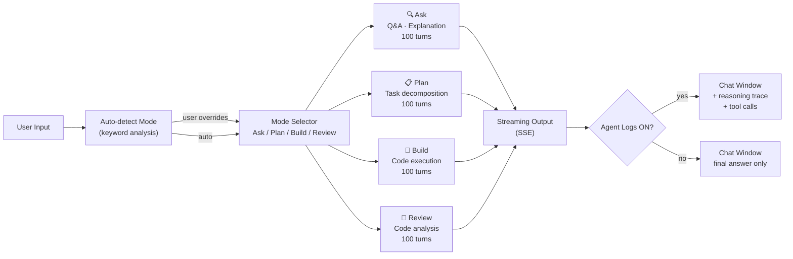
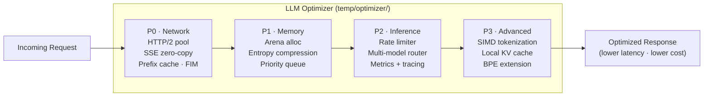

# Generic Coder (Rust)

Rust-first local coding cockpit with an Axum backend, browser Web UI, Electron desktop shell, optional TUI, configurable LLM backends, workspace and Git tools, remote SSH support, workflow modes, ACP multi-agent collaboration, One Shot autonomous mode, Computer Use, **built-in provider profiles, Electron installer packaging, a new Workbench UI, four-mode chat execution (Ask/Plan/Build/Review) with streaming agent logs, and an integrated LLM optimizer pipeline**.

**Language / Idioma / 语言:** [中文](#zh) | [English](#en) | [Español](#es)

---

## Architecture / 架构 / Arquitectura



### Module Map / 模块图



---

### Chat Execution Mode Pipeline / 聊天执行模式管道



### LLM Optimizer Pipeline / LLM 优化器管道



---

## New Features & Improvements / 新增功能与优化 / Nuevas Funciones y Mejoras

### 🆕 Four-Mode Chat Execution System (2026-05-10)

The chat interface now supports four purpose-built execution modes, each with a **100-turn long-task budget**:

| Mode | Icon | Purpose | Behavior |
|------|------|---------|---------|
| **Ask** | 🔍 | Q&A and explanations | Lightweight reasoning; answers directly |
| **Plan** | 📋 | Task decomposition | Produces a structured plan before acting |
| **Build** | 🔨 | Code generation & execution | Full tool-use loop; runs until output is stable |
| **Review** | 🔎 | Code analysis & audit | Reads codebase; produces structured findings |

- **Auto-mode detection** — when no mode is selected, the agent analyzes the input with keyword heuristics and automatically pre-selects the best mode. User override is always respected.
- **Streaming agent logs** — an **Agent Logs** checkbox in the chat toolbar controls whether reasoning traces and tool calls appear in the chat window (default: enabled).
- **IME-aware Enter-to-send** — `Enter` sends the message; `Shift+Enter` inserts a newline. IME composition (Chinese/Japanese/Korean pinyin confirm) is correctly excluded.
- **Command history** — `ArrowUp` / `ArrowDown` inside the input box cycles through prior commands.
- **Red stop button** — clicking the red ■ button immediately cancels all running agent background work.
- **New session button** — clicking **New** beside the session selector opens a fresh context-free session.

### 🆕 LLM Optimizer Pipeline (2026-05-10)

A dedicated optimizer crate (`temp/optimizer/`) implements a four-phase performance and cost reduction pipeline applied to every LLM request:

**P0 – Network Layer (shipped)**
- HTTP/2 connection pool (`h2` crate) — eliminates per-request TCP handshake overhead
- SSE zero-copy parser (`winnow`) — 50% lower CPU on streaming token processing
- Prefix-cache-aware prompt orchestration — fixed system prompt placed first to maximize DeepSeek cache hit rate
- FIM (Fill-in-Middle) native integration for code completion tasks

**P1 – Memory Layer (shipped)**
- `bumpalo` arena allocator — request-scoped memory with 80% lower allocation overhead
- Entropy-based dynamic prompt compression — removes low-information tokens before sending
- Request priority queue — user-visible requests preempt background prefetch work

**P2 – Inference Layer (in progress)**
- Adaptive rate limiter with token-bucket + backoff — near-zero 429 errors
- Multi-model intelligent router — routes simple tasks to cheaper models automatically
- `tracing` + `metrics` observability integration

**P3 – Advanced (planned)**
- SIMD-accelerated tokenization post-processing
- Local KV cache for offline degraded operation
- DeepSeek-specific BPE vocabulary extension

### 🆕 Workspace Directory Priority Fix (2026-05-10)

The agent now strictly respects the workspace directory configured in Settings as the **primary working directory**. File search, shell execution, and all tool operations resolve paths relative to the configured workspace first, falling back to the user home directory only when necessary.

### 🆕 Built-in Provider Profiles

Quick-select from a curated list of provider presets:DeepSeek Global Flash/Pro, DeepSeek China, Qwen, Kimi, MiniMax, Doubao, Tencent Hunyuan, Baidu Qianfan, Zhipu, OpenAI, Anthropic, and OpenRouter. Each profile comes with pre-configured API base, model name, session type, and reasoning effort.

### 🆕 Session Store
Persistent session management with save, load, and switch between multiple coding sessions. Session state includes conversation history, workspace context, and model configuration.

### 🆕 Electron Desktop Installer
Native macOS installers for both arm64 (Apple Silicon) and x64 (Intel) architectures — now available as `.pkg` installers in `ui/dist/`.

### 🆕 Workbench UI (TypeScript/React)
The Electron GUI now includes a new **Workbench** view built with TypeScript/React. It provides:
- Workspace tree browser with collapsible sections
- Chat workspace with conversation management
- Git diff viewer
- Workflow builder with drag-and-drop nodes
- Settings / model configuration panel

### 🆕 Enhanced Computer Use + CDP Bridge
Upgraded browser automation with CDP bridge extension (`assets/tmwd_cdp_bridge/`) for cross-tab, cross-origin, and HttpOnly cookie management. Includes dialog suppression, file upload handling, and image search.

### 🆕 Autonomous Operation System
New SOP-based autonomous operation with:
- Task planning and decomposition
- Helper utilities for scheduling
- Configurable agent reflection cycles

### 🆕 Error Memory & Avoidance Hints
Persistent error memory (`src/error_memory.rs`) tracks repeated failures and provides avoidance hints to the LLM, reducing repetitive mistakes.

### 🆕 Skills Framework
Extensible skills system with 7 built-in skills:
- **CLI Anything**: Natural language to shell commands
- **Brainstorming**: Autonomous decision branching
- **Code Review**: Systematic code review workflow
- **Create Skill**: Meta-skill for crafting new agent skills
- **File Search**: Deep codebase exploration
- **Self Audit**: Agent self-reflection and improvement
- **Webfetch**: Web content retrieval and analysis

### 🎨 UI Overhaul (2026-05-07)
Latest round of UI and interaction refinements:

- **Apple Font System** — Default font stack switched to `-apple-system, BlinkMacSystemFont, 'SF Pro Text', 'SF Pro Display', 'Helvetica Neue', system-ui, sans-serif`. Title bar, toolbar and all button icons enlarged to **2.5×** (40×40px).
- **Window Size** — Default window resized to **1440×960** (min 1000×640), matching Claude Code Desktop standards.
- **Workflow Drag-and-Drop** — Workflow Builder nodes are now draggable; visually connect Work → Plan → Review pipelines.
- **Token Usage Display** — Model status card in the bottom-left corner aggregates token usage by command and shows real-time stats.
- **Collapsible Workspace Sidebar** — Workspace file tree is now collapsible with smooth animation, reducing visual clutter.
- **ArrowUp / ArrowDown Draft Recovery** — Input bar restores previous message drafts on `ArrowUp`/`ArrowDown`, including attachment state.
- **Inline File Preview** — Clicking a workspace file renders text preview or image preview directly in the session area.
- **SVG Attachment Icon** — Attachment button switched from emoji to SVG icon for a unified look on desktop.
- **Chrome Path Auto-Detection** — Computer Use now auto-detects Chrome/Chromium installation path on macOS, Linux, and Windows.
- **Windows Native Menu Hidden** — Electron desktop shell hides the native menubar on Windows for a cleaner top chrome.

### 🖼️ Screenshots / 截图 / Capturas de pantalla

#### Chat Workspace


#### Workflow Builder (Drag-and-Drop)


#### Workspace Tree (Collapsible)


#### Agent Skills （Pre-or-Post Installed）


#### Settings / Model Configuration (Provider Profiles)


---

<a id="zh"></a>

## 中文

### 这是什么

现已切换为 **Rust 主实现**。当前仓库更适合把它理解为一个“本地运行的编码工作台”，核心由 Axum 服务承载，再接三种前端：

- **浏览器 Web UI**：默认入口，适合快速启动和配置模型
- **Electron 桌面 UI**：独立桌面壳，当前界面样式已经往更轻的 Apple 风格收敛
- **TUI**：终端原生界面，适合键盘流操作

当前这套工作台已经能稳定覆盖这些日常场景：

- 与模型对话并触发编码任务
- 保存和切换多套模型配置
- 打开本地工作区，查看文件树、搜索文件、在会话区预览文本或图片文件
- 查看 Git 变更、Diff 与回退辅助
- 连接远程 SSH 环境执行文件和命令操作
- 在需要时启用 ACP 多智能体、One Shot 自主模式、Computer Use

当前推荐入口：
- **Windows 一键启动：** `start-generic-coder.bat`
- **macOS 一键启动：** `bash start-generic-coder.sh`
- **命令行启动：** `cargo run -- serve --host 127.0.0.1 --port 8765`

macOS 启动链路现已补齐到与 Windows 一致：会先自动安装 Electron 依赖、构建 Workbench 前端，再启动桌面壳；若本机没有 `cargo`，会优先复用已构建好的后端二进制。

服务默认运行在：

```text
http://127.0.0.1:8765
```

### 最新功能更新 (2026-05-10)

#### 四模式聊天执行系统

聊天界面现已支持四种执行模式，每种模式均支持 **100 轮超长任务预算**：

| 模式 | 图标 | 适用场景 | 行为策略 |
|------|------|---------|---------|
| **Ask** | 🔍 | 问答与解释 | 轻量推理，直接作答 |
| **Plan** | 📋 | 任务分解与规划 | 先生成结构化计划，再执行 |
| **Build** | 🔨 | 代码生成与执行 | 全工具调用循环，持续运行直到输出稳定 |
| **Review** | 🔎 | 代码审查与分析 | 读取代码库，输出结构化发现 |

- **自动模式识别** — 未选择模式时，Agent 通过关键词启发式分析输入内容，自动预选最合适的模式；用户手动调整后以用户选择为准
- **流式 Agent 日志** — 聊天工具栏中新增 **Agent Logs** 勾选框，控制是否在聊天主窗口显示推理过程和工具调用（默认开启）
- **IME 感知回车发送** — `Enter` 发送命令；`Shift+Enter` 换行；正确排除中文拼音输入法的确认回车
- **历史命令浏览** — 输入栏聚焦时，`ArrowUp` / `ArrowDown` 循环浏览历史命令
- **红色停止按钮** — 点击红色 ■ 按钮立即终止所有后台 Agent 任务
- **New 按钮** — 点击会话旁 **New** 按钮，打开不含任何历史上下文的全新会话

#### LLM 优化器管道

新增 `temp/optimizer/` crate，实现四阶段性能与成本优化管道：

- **P0 — 网络层**（已上线）：HTTP/2 连接池、SSE 零拷贝解析器、前缀缓存感知 Prompt 编排、FIM 原生集成
- **P1 — 内存层**（已上线）：`bumpalo` Arena 分配器、基于信息熵的动态 Prompt 压缩、请求优先级队列
- **P2 — 推理层**（进行中）：自适应限流器、多模型智能路由、`tracing` + `metrics` 可观测性
- **P3 — 高级优化**（规划中）：SIMD 加速分词、本地 KV 缓存降级、DeepSeek 专用 BPE 词表扩展

#### 工作目录优先级修复

Agent 现已严格以 Settings 中配置的工作目录作为**首要工作目录**，所有文件查找和命令执行均以此为基准路径，仅在必要时回退到用户目录。

### 最新 UI 优化 (2026-05-07)


- **Apple 字体系统** — 默认字体切换为 `-apple-system` + SF Pro，所有按钮和图标放大 2.5 倍
- **窗口尺寸** — 默认 1440×960，最小 1000×640
- **工作流节点拖拽** — Workflow Builder 支持节点拖拽连线，Work → Plan → Review 管道可视化
- **Token 用量统计** — 左下角模型状态卡按命令正确聚合 Token 使用量
- **可折叠工作区侧栏** — 工作区文件树可折叠，减少视觉干扰
- **草稿恢复** — 输入栏 `ArrowUp`/`ArrowDown` 恢复上一条草稿，附件状态一并恢复
- **文件行内预览** — 点击工作区文件直接在会话区显示文本/图片预览
- **SVG 附件图标** — 附件按钮从 emoji 改为 SVG 图标
- **Chrome 路径自动检测** — Computer Use 自动检测 Chrome/Chromium 安装路径
- **Windows 菜单栏隐藏** — Electron 桌面壳隐藏原生菜单栏，顶部更简洁

### 当前实现状态

Rust 版本已接管全部运行路径：

| 文件 | 职责 |
|------|------|
| `src/main.rs` | CLI 与服务启动 |
| `src/web.rs` | Axum Web UI 后端，所有 API 路由 |
| `src/agent.rs` | ReAct Agent 循环、任务队列、停止信号 |
| `src/acp.rs` | ACP 多智能体协作协议（Orchestrator + Specialist） |
| `src/oneshot.rs` | One Shot 自主脑暴驱动执行（外层发散 + 内层执行） |
| `src/llm.rs` | Claude / OpenAI 兼容后端与流式解析 |
| `src/workflow.rs` | Ask / Plan / Build / Review 四模式工作流管道（每模式100轮预算） |
| `src/skills.rs` | 可插拔技能注册、安装、启用/禁用管理 |
| `src/error_memory.rs` | 持久化错误记忆与自动回避提示 |
| `src/tools.rs` | 文件读写、Shell、Git、Web、Computer Use 等工具实现 |
| `src/workspace.rs` | 本地工作区管理 |
| `src/remote.rs` | SSH 远程环境连接与管理 |
| `src/media.rs` | 图片/媒体文件处理 |
| `src/provider_profiles.rs` | 内置提供商预设配置 |
| `src/session_store.rs` | 会话持久化与切换 |
| `src/types.rs` | 共享类型定义 |
| `src/config.rs` | 配置加载与持久化 |
| `temp/optimizer/` | LLM 优化器管道（HTTP/2、SSE 零拷贝、前缀缓存、Arena 分配、Prompt 压缩） |
| `tui/src/` | TUI 终端界面 |
| `ui/` | Electron 主进程、预加载脚本、构建配置 |
| `ui/workbench/` | Workbench TypeScript/React 视图 |
| `assets/generic_coder/` | 浏览器 Web UI 资源 |

### 已支持的能力

- Rust + Axum Web 服务
- **Web UI**：浏览器中使用的默认工作台
- **Electron 桌面 UI**：桌面壳、Apple 风格字体、2.5× 图标放大、更轻的顶部 chrome
- **TUI**：终端原生工作台（~2060 行 Rust）
- 多模型配置、切换与本地持久化
- 内置 15+ 提供商预设配置（DeepSeek / Qwen / Kimi / MiniMax / Doubao / Hunyuan / Qianfan / Zhipu / OpenAI / Anthropic / OpenRouter）
- 本地工作区选择、文件树浏览、文件搜索、文本/图片预览
- 可折叠工作区侧栏
- Git 变更查看、Diff 预览、回退辅助
- 远程 SSH 连接与文件/命令操作
- 图片上传到上下文
- **Ask / Plan / Build / Review** 四模式执行系统（每模式 100 轮超长任务预算）
- 自动模式识别 + 用户手动覆盖
- 流式 Agent 日志（可在聊天窗口开启/关闭）
- IME 感知回车发送 + Shift+Enter 换行 + 命令历史浏览
- Work / Plan / Review 工作流节点拖拽连线
- ACP 多智能体协作（Orchestrator + Specialist 架构）
- One Shot 自主脑暴驱动执行
- 7 项预设技能，支持远程安装新技能
- 持久化错误记忆 + 自动回避提示
- Computer Use（截屏 + 鼠标/键盘操作），CDP 桥接扩展
- LLM 优化器管道（HTTP/2、SSE 零拷贝、前缀缓存、Arena 分配、Prompt 压缩）
- Electron 桌面安装打包（macOS arm64 / x64 .pkg）
- Token 用量实时统计
- 输入草稿恢复（ArrowUp / ArrowDown）
- 命令面板（⌘K / ⌘P）
- 多主题切换

---

<a id="en"></a>

## English

### What is this?

Generic Coder is a **local AI coding cockpit** built with Rust + Axum at the backend, offering three frontend options:

- **Web UI** (browser default, zero install)
- **Electron Desktop** (polished native shell with Apple design language)
- **TUI** (terminal native, keyboard-centric)

The architecture is fully Rust-powered, with no Python dependency. The frontend communicates with the backend via HTTP/JSON APIs.

### What it covers

- Chat with LLM and trigger coding tasks
- Save and switch between multiple model configurations
- Open a local workspace: browse file tree, search files, preview text/image inline
- Git diff viewer with revert assistance
- Remote SSH connection for file and command operations
- **Four execution modes: Ask / Plan / Build / Review** — each with 100-turn long-task budget, streaming output, and auto-detection from input
- Streaming agent logs toggle in chat toolbar
- IME-aware Enter-to-send; Shift+Enter for newline; ArrowUp/Down command history
- ACP multi-agent orchestration (Orchestrator + Specialist)
- One Shot autonomous brainstorming execution
- 7 built-in skills (CLI Anything, Brainstorming, Code Review, Create Skill, File Search, Self Audit, Webfetch)
- Persistent error memory with avoidance hints
- Computer Use (screenshots + keyboard/mouse automation, CDP bridge)
- Built-in provider profiles for 15+ LLM providers
- **LLM Optimizer Pipeline**: HTTP/2 connection pool, SSE zero-copy parser, prefix-cache-aware prompt orchestration, FIM integration, entropy-based prompt compression, arena allocator
- Electron desktop installer packaging for macOS (arm64 + x64)

### Quick start

#### 1. Install Rust

```bash
rustc --version
cargo --version
```

If you don't have Rust yet, install [Rustup](https://rustup.rs/).

#### 2. Clone the repository

```bash
git clone https://github.com/sapsapshen/Generic-Coder-Rust.git
cd Generic-Coder-Rust
```

#### 3. Launch the application

**Windows** — Double-click `start-generic-coder.bat`

**macOS / Linux**

```bash
bash start-generic-coder.sh
```

The macOS/Linux launcher now mirrors the Windows startup flow: it installs Electron dependencies when needed, rebuilds the workbench before launch, and falls back to a prebuilt backend binary when Cargo is unavailable.

**Manual**

```bash
cargo run -- serve --host 127.0.0.1 --port 8765
```

#### 4. Open the interface

```text
http://127.0.0.1:8765
```

Or launch the Electron desktop app.

### Model Configuration

You can configure models in two ways:
1. **Recommended:** From **Settings** in the Web UI (with built-in provider profiles)
2. By creating `mykey.json` in the project root from `mykey.json.example`

The UI already includes presets for common providers: DeepSeek, Qwen / DashScope, Kimi / Moonshot, MiniMax, Doubao / Ark, Tencent Hunyuan, Baidu Qianfan, Zhipu, OpenAI / Anthropic / OpenRouter.

You can also configure manually: session type, base URL, provider, model name, and API key.

Saved configurations from the UI are written to the user's local profile, not the repository.

### Recent Updates (2026-05-10)

- **Four-Mode Execution System** — Ask / Plan / Build / Review; all modes unified to 100-turn long-task budget
- **Auto-Mode Detection** — keyword heuristics auto-select the best mode; manual override always wins
- **Streaming Agent Logs** — Agent Logs checkbox in toolbar shows/hides reasoning traces and tool calls in the chat window
- **IME-Aware Enter-to-Send** — `Enter` sends; `Shift+Enter` newline; Chinese/Japanese IME composition excluded
- **Command History** — `ArrowUp` / `ArrowDown` navigates prior commands
- **Red Stop Button** — immediately cancels all background agent work
- **New Session Button** — opens a fresh zero-context session
- **Workspace Directory Priority** — configured workspace dir is the strict primary CWD for all agent tool operations
- **LLM Optimizer Pipeline (P0–P1 shipped)** — HTTP/2 pool, SSE zero-copy parser, prefix-cache-aware orchestration, FIM integration, entropy-based prompt compression, arena allocator

### Recent UI & Interaction Optimizations (2026-05-07)

- **Apple Font System** — Font stack switched to native Apple typography (`-apple-system, 'SF Pro Text', 'SF Pro Display'`); all UI icons enlarged **2.5×**.
- **Window Size** — Default 1440×960 for better readability.
- **Drag-and-Drop Workflow** — Workflow Builder nodes are now draggable; visually connect Work → Plan → Review pipelines.
- **Token Usage Display** — Bottom-left model card aggregates real-time token usage by command.
- **Collapsible Sidebar** — Workspace file tree collapses with smooth animation.
- **Draft Recovery** — `ArrowUp` / `ArrowDown` restores previous message draft and attachment state.
- **Inline File Preview** — Click workspace file to preview text or image directly in the session area.
- **SVG Attachment Icon** — Replaced emoji with SVG icon for unified look.
- **Chrome Auto-Detection** — Computer Use auto-detects Chrome/Chromium on all platforms.
- **Windows Menu Hide** — Electron hides native menubar on Windows.

### Electron Desktop Installer

Installers for macOS are available in `ui/dist/`:
- `Generic Coder-1.0.0-arm64-installer.pkg` — Apple Silicon
- `Generic Coder-1.0.0-x64-installer.pkg` — Intel Mac

### Development

```bash
cargo test
cargo check --bin generic-coder
cargo build --release
```

### Project Structure

```text
src/
  main.rs           CLI + server startup
  web.rs            Web UI backend (Axum)
  agent.rs          Agent loop and task execution
  acp.rs            ACP multi-agent collaboration
  oneshot.rs        One Shot autonomous brainstorm execution
  llm.rs            Model integration and streaming parser
  workflow.rs       Ask/Plan/Build/Review execution modes (100-turn budget each)
  error_memory.rs   Error memory with avoidance hints
  skills.rs         Skill registration and management
  tools.rs          Tool implementations (incl. Computer Use)
  workspace.rs      Workspace management
  remote.rs         SSH remote support
  media.rs          Media file handling
  provider_profiles.rs  Built-in provider presets
  session_store.rs  Session persistence
  types.rs          Shared type definitions
  config.rs         Configuration loading and persistence
tui/                Terminal TUI interface (~2060 lines Rust)
ui/                 Electron desktop GUI app + scripts
  workbench/        Workbench TypeScript/React view
  dist/             Build artifacts and installers
  assets/           Electron assets
  scripts/          Launch and build scripts
assets/             Web frontend resources, images, demos
  tmwd_cdp_bridge/  CDP bridge extension for browser
skills/             7 built-in skill modules
memory/             Autonomous memory system (L1-L4)
temp/optimizer/     LLM optimizer pipeline crate (HTTP/2, SSE zero-copy, prefix cache, FIM, compression)
```

---

<a id="es"></a>

## Español

### ¿Qué es esto?

Generic Coder es un **puesto de control de desarrollo local con IA**, construido con Rust + Axum en el backend y tres opciones de frontend:

- **Web UI** (navegador, sin instalación)
- **Electron Desktop** (shell nativo pulido con diseño Apple)
- **TUI** (terminal nativa, centrada en teclado)

Toda la arquitectura está implementada en Rust, sin dependencia de Python.

### Capacidades incluidas

- backend en Rust + Axum
- Web UI para navegador
- Electron desktop UI para uso local empaquetado
- TUI para flujos de terminal
- configuración multi-modelo con persistencia local
- perfiles de proveedores integrados (DeepSeek, Qwen, Kimi, MiniMax, Doubao, Hunyuan, Qianfan, Zhipu, OpenAI, Anthropic, OpenRouter)
- selección de workspace, árbol de archivos colapsable, búsqueda y previsualización de texto o imagen
- revisión de cambios Git, vista previa de diff y ayudas de revert
- operaciones remotas por SSH
- subida de imágenes al contexto del chat
- modos de ejecución **Ask / Plan / Build / Review** (100 turnos por modo, con detección automática)
- logs de agente en streaming (toggle en toolbar)
- Enter para enviar (IME-aware); Shift+Enter para nueva línea; historial de comandos con ArrowUp/Down
- colaboración multi-agente ACP
- modo autónomo One Shot
- sistema de 7 skills y memoria persistente de errores
- Computer Use para capturas e input del sistema + puente CDP
- pipeline optimizador LLM (HTTP/2, SSE zero-copy, caché de prefijo, compresión de prompt)
- instalador de escritorio Electron para macOS (arm64 + x64)
- estadísticas de uso de tokens en tiempo real
- recuperación de borrador con ArrowUp / ArrowDown

### Optimizaciones recientes de UI (2026-05-07)

- **Sistema de fuentes Apple** — Tipografía nativa SF Pro, iconos 2.5× más grandes
- **Tamaño de ventana** — 1440×960 predeterminado
- **Workflow arrastrable** — Nodos del Workflow Builder conectables visualmente
- **Panel lateral colapsable** — Árbol de workspace plegable
- **Vista previa en línea** — Vista previa de texto/imagen al hacer clic en archivos
- **Recuperación de borrador** — ArrowUp/ArrowDown recupera el borrador anterior
- **Icono SVG** — Botón de adjuntar cambiado a SVG
- **Auto-detección de Chrome** — Computer Use detecta Chrome automáticamente

### Configuración de modelos

Puedes configurar modelos de dos formas:
1. **Recomendado:** desde **Settings** en la interfaz web (con perfiles de proveedores integrados)
2. Creando `mykey.json` en la raíz del proyecto a partir de `mykey.json.example`

La UI ya incluye preajustes para proveedores comunes: DeepSeek, Qwen / DashScope, Kimi / Moonshot, MiniMax, Doubao / Ark, Tencent Hunyuan, Baidu Qianfan, Zhipu, OpenAI / Anthropic / OpenRouter.

También se puede configurar manualmente: tipo de sesión, base URL, proveedor, nombre del modelo y API key.

Las configuraciones guardadas desde la UI se escriben en el perfil local del usuario, no en el repositorio.

### Inicio rápido

#### 1. Instala Rust

```bash
rustc --version
cargo --version
```

Si aún no tienes Rust, instala [Rustup](https://rustup.rs/).

#### 2. Clona el repositorio

```bash
git clone https://github.com/sapsapshen/Generic-Coder-Rust.git
cd Generic-Coder-Rust
```

#### 3. Inicia la aplicación

**Windows** — Haz doble clic en `start-generic-coder.bat`

**macOS / Linux**

```bash
bash start-generic-coder.sh
```

El iniciador de macOS/Linux ahora sigue el mismo flujo que Windows: instala las dependencias de Electron cuando hace falta, recompila el workbench antes de abrir y reutiliza un binario backend ya compilado si Cargo no está disponible.

**Manual**

```bash
cargo run -- serve --host 127.0.0.1 --port 8765
```

#### 4. Abre la interfaz

```text
http://127.0.0.1:8765
```

O inicia la aplicación de escritorio Electron.

### Instalador de Escritorio Electron

Los instaladores para macOS están disponibles en `ui/dist/`:
- `Generic Coder-1.0.0-arm64-installer.pkg` — Apple Silicon
- `Generic Coder-1.0.0-x64-installer.pkg` — Intel Mac

### Desarrollo

```bash
cargo test
cargo check --bin generic-coder
cargo build --release
```

### Estructura del proyecto

```text
src/
  main.rs           CLI + inicio del servidor
  web.rs            Backend de la interfaz web (Axum)
  agent.rs          Bucle del agente y ejecución de tareas
  acp.rs            Colaboración multi-agente ACP
  oneshot.rs        Ejecución autónoma con lluvia de ideas
  llm.rs            Integración de modelos y parser de streaming
  workflow.rs       Pipeline de flujo (Ask/Plan/Build/Review, 100 turnos c/u)
  error_memory.rs   Memoria de errores y sugerencias
  skills.rs         Registro y gestión de habilidades
  tools.rs          Implementación de herramientas (incl. Computer Use)
  workspace.rs      Gestión del espacio de trabajo
  remote.rs         Soporte SSH remoto
  media.rs          Manejo de medios
  provider_profiles.rs  Perfiles de proveedores integrados
  session_store.rs  Persistencia de sesiones
  types.rs          Definiciones de tipos compartidos
  config.rs         Carga y persistencia de configuración
tui/                Interfaz de terminal TUI (~2060 líneas Rust)
ui/                 App de escritorio Electron GUI + scripts
  workbench/        Vista Workbench TypeScript/React
  dist/             Artefactos de compilación e instaladores
  assets/           Recursos de Electron
  scripts/          Scripts de lanzamiento y compilación
assets/             Recursos del frontend web, imágenes, demos
  tmwd_cdp_bridge/  Extensión de puente CDP para navegador
skills/             7 módulos de habilidades integradas
memory/             Sistema de memoria autónoma (L1-L4)
temp/optimizer/     Pipeline optimizador LLM (HTTP/2, SSE zero-copy, caché prefijo, compresión)
```

---

## License / 许可 / Licencia

MIT
