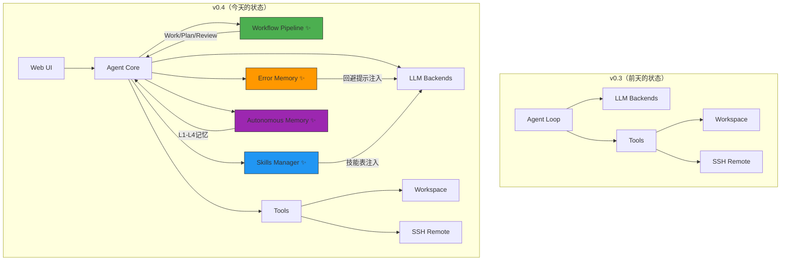
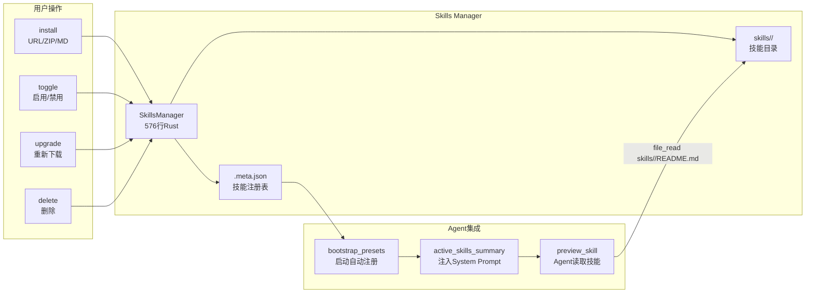
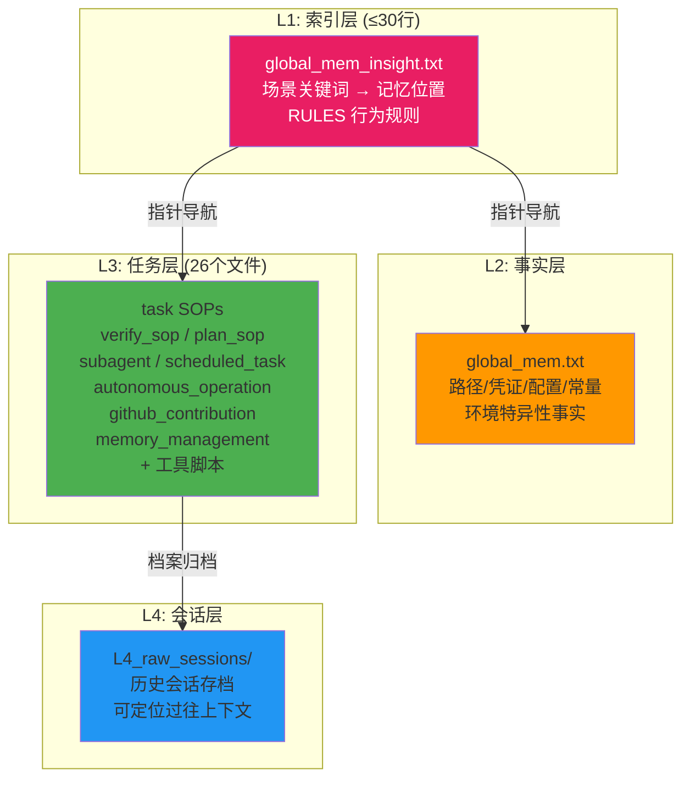

# Rust 版本来真的了：Generic Coder 这两天的更新，比前两个月还猛

> 上一篇文章我们说"Rust 版本刚开发好"。但实话讲，那个「刚开发好」的状态，更像是把骨架拼好了——能站，能走，但你还不敢真的跑起来。
>
> 两天过去，四个全新子系统上线，11842 行 Rust 代码，5 个预装技能，26 个记忆模块。现在这个东西，**敢让你开上高速公路了**。

---

## 先别急着看代码，看一眼改了什么地方



对比图一目了然。四个带 ✨ 的新模块，让整个架构从「线性执行」变成了「闭环自治」。这就是从 "代码能跑" 到 "系统能持续运行" 的质变。

---

## 更新一：Workflow Pipeline —— 从「一刀切」到「三轨并行」

还记得上一篇文章里说「把 Trae 的 Plan 模式塞进去」吗？现在不只是塞进去了，还多送了两个。

整个 Workflow 系统支持三种 Agent 模式，每种都有独立的执行策略：

| 模式 | 轮次上限 | 核心指令 | 适用场景 |
|------|---------|---------|---------|
| **WORK** | 70 轮 | 实现目标，使用工具，确保完成 | 日常编码任务 |
| **PLAN** | 100 轮 | 探索代码库，设计方案，识别风险，**不得修改代码** | 大型重构前 |
| **REVIEW** | 50 轮 | 审计正确性/错误处理/安全/性能/风格，报告不修改 | PR Review |

代码量的变化很能说明问题——整个 `workflow.rs` 只有 **155 行**。

为什么这么少？因为核心逻辑足够简洁：三个模式的差异只体现在「轮次上限」和「system prompt 前缀」。额外的复杂度——比如拖拽工作流构建、连续同模式校验——都是在不影响核心逻辑的前提下叠加上去的。

小细节但关键：**不允许连续相同模式**（防止你手滑设了 `PLAN → PLAN`），**最多 3 个节点**（超过 3 步的工作流要么你在折磨自己，要么应该拆成多次对话）。

使用时在 UI 上拖拽排序即可：WORK → PLAN → REVIEW，或者 PLAN → WORK，随你组合。

---

## 更新二：Error Memory —— 让 Agent 学会「记仇」

这是我觉得最解气的一个更新。按理说，前面的更新已经够硬了，但这个更狠。

### 问题

大模型每次对话都是白纸一张——它不记得刚才 `file_read` 失败了是因为你给了一个不存在的路径，也不记得上一个 session 里相同的语法错误已经犯了 5 次。所有成熟的开发者都有肌肉记忆——但这个记忆在 LLM 层面是不存在的。

### 解决方案

一个持久化的错误记忆系统，423 行代码实现以下完整链路：

```
工具调用失败
    ↓
自动分类 (10 种错误类型: not_found / permission / timeout / connection / parse_error / http_error / rate_limit / oom / panic / general)
    ↓
生成指纹 (tool:category, 如 "file_read:not_found")
    ↓
记录到 JSON (计数/时间/模型/上下文/回避提示)
    ↓
重复 ≥2 次 → 注入 Agent System Prompt
    ↓
Agent 在下次执行时自动规避
```

举个例子。如果你反复给了 `file_read` 不存在的路径，系统会在 Agent 的 system prompt 里自动追加：

```
## Error Experience (auto-avoid)

- **file_read (not_found)** (×5, last: 2026-05-04):
  Before file_read, verify the path exists using workspace_list or check parent directory first.
```

这是一个**跨会话**的记忆。你关了浏览器，明天打开，这个经验还在。Agent 不再是个健忘症患者。

代码实现上还有个精妙之处——`classify()` 方法用了关键词匹配而非正则或 NLP，不到 30 行覆盖了 10 种错误类型。这符合 Generic Agent 一贯的哲学：**能用最简单的方案解决的问题，不嫁复杂的依赖**。

---

## 更新三：Skills Manager —— 可插拔的技能系统

如果说 Workflow 是 Agent 的「工作模式」，Error Memory 是 Agent 的「工作经验」，那 Skills 就是 Agent 的「专业技能」。

这次上线了 5 个预装技能 + 完整的技能生命周期管理：



### 5 个预装技能

| 技能 | 触发场景 | 一句话 |
|------|---------|--------|
| **code-review** | 审查代码变更 | 系统性代码审查工作流 |
| **webfetch** | 读取网页内容 | URL → Markdown → 分析 |
| **file-search** | 探索代码库 | 深度代码库搜索与探索 |
| **create-skill** | 创建新技能 | 元技能：教你怎么写新技能 |
| **self-audit** | 任务卡壳/连续失败 | Agent 自我反思与改进 |

这套系统设计的一个核心原则：**Agent 自己就能操作**。Skill 安装后，Agent 的 system prompt 中会自动注入一份技能表（名称/描述/触发条件），Agent 需要用到时自己会 `file_read skills/<name>/README.md` 来读取详细流程。不需要用户手动教它。

更妙的是 `bootstrap_presets()`——你把技能目录放到 `skills/` 下，启动时自动扫描注册。zero config。

---

## 更新四：Autonomous Memory Stack —— L1 到 L4 的记忆架构

这个更新最「底层」，但也最有长期价值。

Generic Coder 的记忆系统不是简单的「把日志存起来」。它是一套严格分层的记忆架构：



### 这套系统的核心公理

1. **无行动，不记忆**：任何写入 L1/L2/L3 的信息必须来自成功的工具调用——禁止把模型的「猜测」当事实存起来
2. **神圣不可删改**：经过验证的有效数据压缩可以，丢弃不行
3. **禁止易变状态**：不存 PID、临时路径、当前时间戳
4. **最小充分指针**：上层只放「在哪里能找到更详细的东西」的最短关键词

翻译成人话就是：这个系统**不会越来越脏**。很多 AI Coding 工具用久了会变成一团乱麻——记忆里堆满了过期的路径、错误的环境信息、半年前的会话记录。L1-L4 的分层严格执行「只存验证过的、只存长期有用的」，每层有明确的职责边界。

### L3 的亮点：不只是存，还敢自己跑

L3 不光是「任务 SOP」的文档库，还内置了完整的**自主运行能力**：

- **subagent 系统**：Map 模式并行分发、监察模式输出审计、文件 IO 协议通信
- **plan 模式**：探索态 → 规划态 → 执行态 → 验证态的完整闭环，subagent 对抗性验证
- **scheduled_task**：定时任务调度，scheduler 每 60 秒轮询，支持 daily/weekday/weekly/monthly/once/every_Nh/every_Nd
- **autonomous_operation**：用户离线时自主执行，写报告待审，不超过 30 轮

这意味着什么？**即使你不在电脑前，Generic Coder 也能按计划继续工作**。睡一觉，第二天早上看报告。

---

## 横向对比：v0.3 vs v0.4

| 维度 | v0.3（前天） | v0.4（今天） |
|------|------------|------------|
| 代码量 | ~7 个核心模块 | **14 个模块**，11842 行 |
| 执行模式 | 单一循环 | **Work/Plan/Review 三模式** + 管道 |
| 错误处理 | 抛异常就抛了 | **跨会话记忆** + 自动避坑提示 |
| 技能系统 | 无 | **5 预装 + 可安装/升级/禁用** |
| 记忆层 | 分散的 md 文件 | **L1-L4 严格分层** + 公理约束 |
| 自主运行 | 手动触发 | **定时任务 + 自主探索 + subagent 并行** |
| 启动方式 | cargo run / .bat | **+ macOS .sh 一键启动** |
| 测试覆盖 | 基础 | **完整单元测试**（error_memory, skills） |

---

## 说白了，这 48 小时干了什么

如果把 Generic Coder 的演化看成一个人的成长，那相当形象：

- **v0.3 之前**：学会了走路（Rust 重写），会说话（LLM 对话），会用手（工具链）
- **这 48 小时**：学会了 Plan 模式（先想再做）、学会了 Review 模式（做完再检查）、学会了从错误中学习（Error Memory）、学会了专业技能（Skills Manager）、还给自己装了套管用的记忆系统（L1-L4）。

一个能自省的 Agent，跟一个只能执行的 Agent，是两类物种。

---

## 废话不多说

```bash
git clone https://github.com/sapsapshen/Generic-Coder-Rust.git
cd Generic-Coder-Rust
cargo run -- serve --host 127.0.0.1 --port 8765
# 打开 http://127.0.0.1:8765
```

或者 macOS 一键启动：

```bash
bash start-generic-coder.sh
```

原 Python 版依然在维护：https://github.com/sapsapshen/Generic-Coder

---

*上一篇说的是"轻才是对的"。这篇说的是"光轻不够，得有脑子"。*

*下一篇写什么，我也不知道。但看这个更新频率，应该不会让你等太久。*
