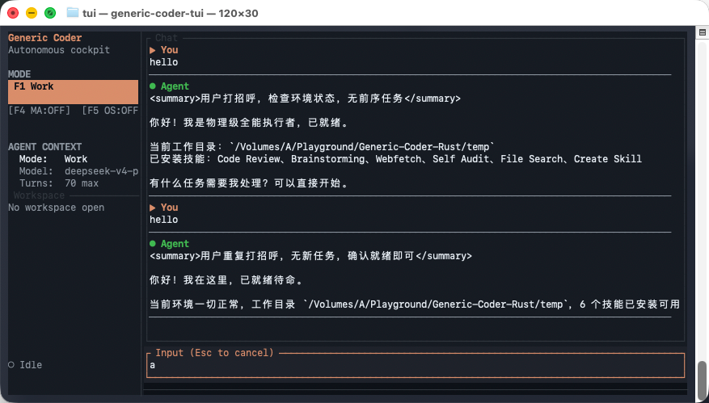
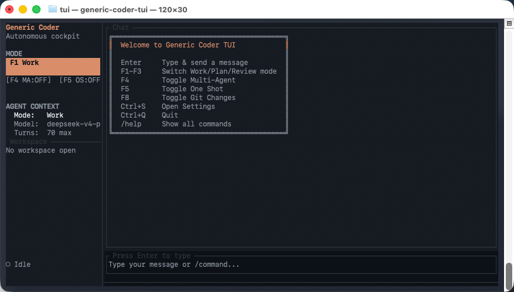
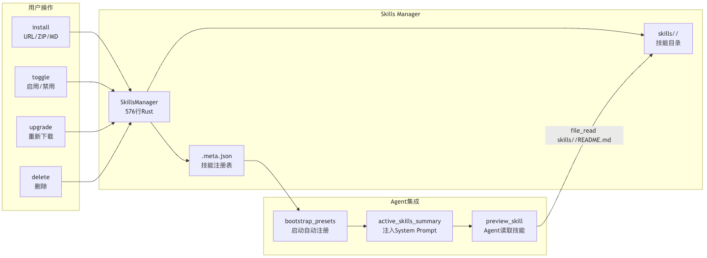
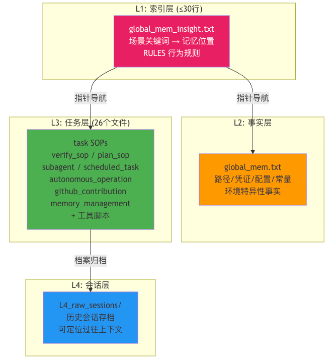

# Generic Coder v0.5.0 更新日志：GUI 是给人类用的，TUI 是给极客用的，Computer Use 是给 AI 用的

> 一次更新，三个界面，七项技能，外加让 AI 直接操控你电脑的能力——你准备好了吗？

---

## 开场白

距离上次更新又过去了一段时间。我们没闲着——这段时间的 commit 记录就像一场永无止境的装修工程：今天修窗户，明天换地板，后天发现承重墙歪了推倒重来。好在结果不错：**Generic Coder 现在同时拥有了 TUI 和 GUI 两种交互界面，内置了 Computer Use 能力，默认集成了 cli-anything 技能，并且整个 GUI 的门面终于不再是 14px 小字了**。

让我们一一盘点。

---

## 1. TUI：当终端成为一种美德



不是每个人都喜欢 Electron。有些人生来就属于终端——黑底白字，Vim 键位，鼠标是多余的累赘。为此我们带来了 **Generic Coder TUI**（`tui/`），一个基于 Rust 原生构建的终端用户界面。

TUI 的组件体系完整复刻了 Web 端的核心功能：

| 组件 | 文件 | 职责 |
|------|------|------|
| `app.rs` | 1003行 | 应用主状态机，管理所有交互逻辑 |
| `ui.rs` | 611行 | 终端渲染引擎，布局计算与绘制 |
| `sidebar.rs` | 181行 | 侧边栏：会话列表、工作流切换 |
| `main.rs` | 162行 | 入口：事件循环、WebSocket 连接 |
| `event.rs` | 30行 | 键盘事件映射（完整 Vim 风格） |
| `status.rs` | 65行 | 状态栏：模型名、Token 计数 |

**在终端里输入 `cargo run`，一个完整的 AI 编码驾驶舱就出现在你面前。** 不用 Electron，不用 Chromium，不用等待 500MB 的运行时加载。纯 Rust，纯终端，纯粹的高效。

TUI 支持完整的工作流模式切换（Work → Plan → Review），会话管理，实时流式输出，以及——零编译警告。是的，我们把 11 个 `dead_code` 警告全部处理干净了。Clean code or die trying.

---

## 2. GUI 大跃进：从「能用」到「好看」



如果说 TUI 是给极客的礼物，那 GUI 就是给所有人的大门。v0.5.0 的 GUI 经历了外科手术式的美化改造：

### 2.1 字体革命

GUI 默认字体从 14px 提升到 **16px**，字体栈切换为 Apple 原生风格：

```css
font-family: -apple-system, BlinkMacSystemFont, 'SF Pro Text', 'SF Pro Display',
             'Helvetica Neue', system-ui, sans-serif;
```

标题栏、工具栏和所有按钮图标同步放大到原来的 **2.5 倍**。之前 28×28px 的小按钮现在 40×40px，再也不用拿放大镜找设置按钮了。

### 2.2 窗口尺寸对齐行业标准

默认窗口大小从 1280×860 调整到 **1440×960**，最小尺寸从 900×600 提升到 1000×640。是的，我们直接把 Claude Code Desktop 的窗口尺寸拿来用了——**好的设计不需要重新发明**。

### 2.3 安装包命名规范化

不再产出 `Generic Coder-1.0.0-mac.zip` 这种不分架构的通用包。现在的产物干净利落：

```
Generic Coder-1.0.0-arm64.dmg
Generic Coder-1.0.0-arm64-mac.zip
Generic Coder-1.0.0-x64.dmg
Generic Coder-1.0.0-x64-mac.zip
```

架构一目了然，Intel 还是 Apple Silicon 各取所需。

---

## 3. Computer Use：让你的 AI 学会「动手」



这是本次更新最「危险」也最激动人心的功能。**Computer Use 让 AI 不再只是一个会聊天的盒子——它能直接操控你的电脑。**

### 3.1 能力清单

新增两个工具，直接注册在 `tools_schema.json` 中：

| 工具 | 功能 |
|------|------|
| `computer_screenshot` | 截取屏幕（支持区域选择/指定显示器），返回 Base64 PNG |
| `computer_action` | 执行鼠标/键盘操作（12 种动作类型） |

支持的**鼠标动作**：左键点击、右键点击、双击、三击、中键点击、鼠标移动、鼠标按下/释放、拖拽。

支持的**键盘动作**：键入文本、组合键（`cmd+a`、`shift+tab`）、特殊键（Return、Escape、方向键、F1-F12）。

### 3.2 跨平台实现

底层实现遵循「有什么用什么」的原则：

- **macOS**：优先使用 `cliclick`（高精度），自动回退到 `osascript` + AppleScript。截图调用原生 `screencapture` 命令。
- **Linux**：调用 `xdotool`（鼠标/键盘）和 `scrot`/ImageMagick（截图）。
- **Windows**：PowerShell + .NET `System.Windows.Forms` API。

### 3.3 安全模型

侧边栏 Agent 区域新增 **Computer Use 开关**（默认启用）。关闭后 AI 无法调用任何屏幕或输入设备工具。API 端点 `/api/computer-use` 支持运行时切换。

> **友情提醒**：Computer Use 不是 sudo。AI 的操作权限等于当前用户的权限。别在 root 用户下开着 Computer Use 然后去泡咖啡。

---

## 4. Skills 系统：七项默认技能，开箱即用



v0.5.0 的 Skills 系统升级到了 7 项预设技能，启动时自动注册：

| 技能 | 用途 |
|------|------|
| **cli-anything** | 🆕 自然语言转 Shell 命令，支持 macOS/Linux/Windows |
| **brainstorming** | 自主分支选项生成，决策树探索 |
| **code-review** | 代码审查：安全、性能、可维护性 |
| **create-skill** | 教你创建自定义技能 |
| **file-search** | 深度代码库探索与追溯 |
| **self-audit** | AI 自我审查与输出质量把控 |
| **webfetch** | 网页内容抓取与分析 |

修复了一个隐蔽的 bug：`package.json` 的 `"!**/*.md"` 模式把 Skills 的 README.md 全部排除了，导致打包后的 skills 目录是空的。现在改为 `"!assets/*.md"` 精准打击。

---

## 5. 架构优化：那些你看不见但很重要的事

### 5.1 后端自启动

后端 Rust 二进制现在完全嵌入 Electron 应用包（通过 `extraResources`），启动时自动 spawn 子进程。创建完整的项目目录树：

```
~/Library/Application Support/Generic Coder/
├── assets/          # 提示词、工具 schema、图标
├── memory/
│   └── errors/      # 错误记忆持久化
├── skills/          # 7 项预设技能自动注册
└── temp/            # 临时文件、备份
```

**用户不需要手动启动任何东西**。双击 .app，前后端一起启动。

### 5.2 CSP 修复

内容安全策略中只允许了 `localhost` 但实际连接的是 `127.0.0.1`，浏览器把它们当作不同源直接拦截所有 fetch 请求。修复后 CSP 同时允许两种地址。

### 5.3 构建系统

macOS 构建脚本已稳定产出四种安装包，支持增量构建（图标生成可跳过），自动清理残留挂载点。不再需要手动敲 20 行命令。

---

## 6. 其他改进

- **IME 输入法修复**：Enter 键发送消息前检查 `event.isComposing`，中文输入法候选词确认不再误触发送
- **Stop 按钮加固**：信号传播到 agent 循环的每个检查点，前端立即重置状态并打开新会话
- **多架构构建**：支持 arm64 和 x64 独立构建，不再混在一个包
- **字体大小持久化修复**：Settings key 版本化，避免旧 localStorage 数据覆盖新默认值

---

## 7. 技术栈一览

| 层 | 技术 |
|----|------|
| 后端 | Rust + Axum + Tokio + reqwest |
| 前端 | Electron 33 + Vanilla JS (零框架) |
| TUI | Rust + crossterm / ratatui |
| LLM 协议 | OpenAI / Claude / 国产大模型全兼容 |
| 自动化 | screencapture + osascript / xdotool / PowerShell |
| 打包 | electron-builder + hdiutil |

---

## 结语

从 v0.4 到 v0.5，Generic Coder 从一个「功能能跑」的原型变成了一个「真正能用」的桌面应用。它现在有了漂亮的门面（Apple 字体！16px！2.5倍图标！），有了极客的灵魂（TUI！零编译警告！），还有了点危险的武器（Computer Use！）。

但我们还远没到终点。下一步的方向：

- **Windows/Linux 完整测试**（目前主要在 macOS 验证）
- **WebSocket 实时通信替代 HTTP 轮询**
- **更多国产大模型预设**
- **拖拽文件上传**

**欢迎 Star、PR，以及——如果你敢开着 Computer Use 让它帮你写代码——欢迎分享录屏，我们想看看你的 AI 会不会手滑删库。**

---

*Generic Coder — Autonomous AI Coding Cockpit*
*https://github.com/your-org/generic-coder*
